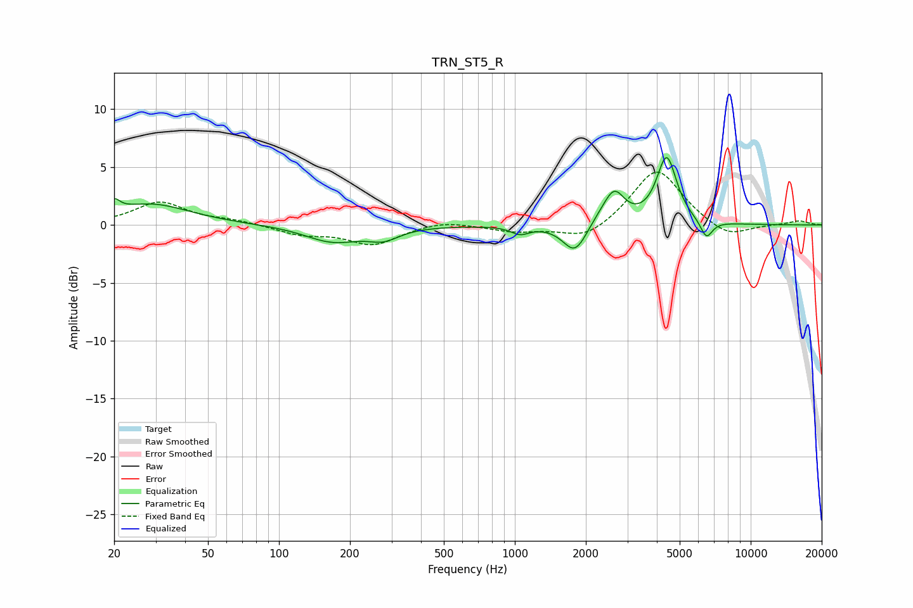

# TRN_ST5_R
See [usage instructions](https://github.com/jaakkopasanen/AutoEq#usage) for more options and info.

### Parametric EQs
Apply preamp of -5.9 dB when using parametric equalizer.

|   # | Type    |   Fc (Hz) |    Q |   Gain (dB) |
|-----|---------|-----------|------|-------------|
|   1 | Peaking |        20 | 5.89 |         1   |
|   2 | Peaking |        29 | 0.85 |         1.8 |
|   3 | Peaking |       169 | 1.21 |        -1.4 |
|   4 | Peaking |       278 | 2.18 |        -0.9 |
|   5 | Peaking |      1052 | 3.66 |        -0.7 |
|   6 | Peaking |      1799 | 2.78 |        -2.6 |
|   7 | Peaking |      2362 | 2.38 |         0.7 |
|   8 | Peaking |      2647 | 3.32 |         2.4 |
|   9 | Peaking |      4403 | 3.35 |         5.7 |
|  10 | Peaking |      6488 | 5.35 |        -1.6 |

### Fixed Band EQs
When using fixed band (also called graphic) equalizer, apply preamp of **-4.7 dB** (if available) and set gains manually with these parameters.

|   # | Type    |   Fc (Hz) |    Q |   Gain (dB) |
|-----|---------|-----------|------|-------------|
|   1 | Peaking |        31 | 1.41 |         2   |
|   2 | Peaking |        62 | 1.41 |         0.3 |
|   3 | Peaking |       125 | 1.41 |        -0.8 |
|   4 | Peaking |       250 | 1.41 |        -1.6 |
|   5 | Peaking |       500 | 1.41 |         0.4 |
|   6 | Peaking |      1000 | 1.41 |        -0.6 |
|   7 | Peaking |      2000 | 1.41 |        -1.4 |
|   8 | Peaking |      4000 | 1.41 |         5   |
|   9 | Peaking |      8000 | 1.41 |        -1.2 |
|  10 | Peaking |     16000 | 1.41 |         0.4 |

### Graphs

