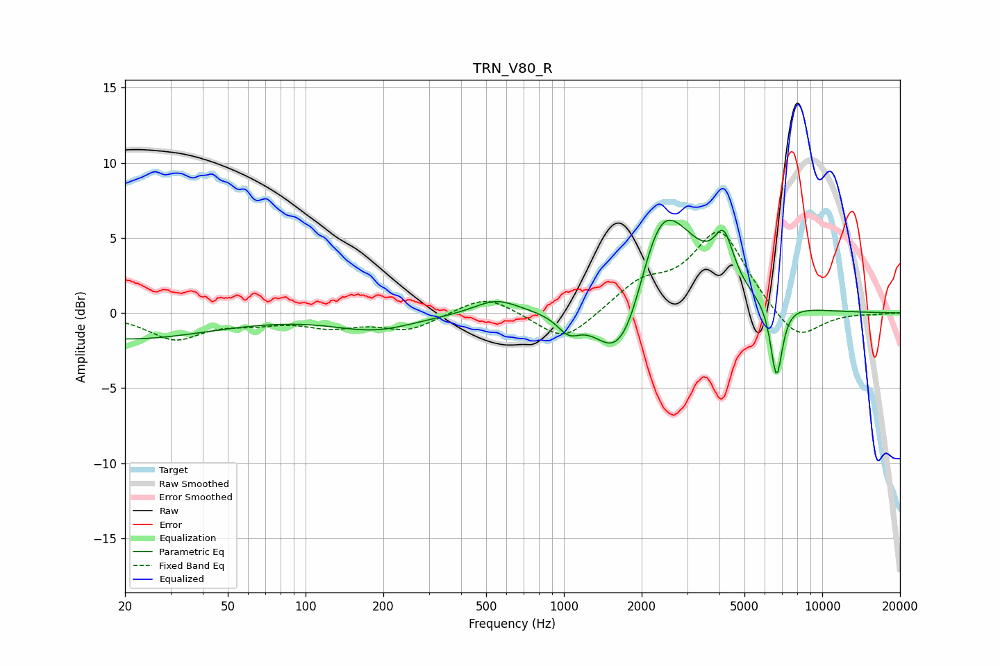

# TRN_V80_R
See [usage instructions](https://github.com/jaakkopasanen/AutoEq#usage) for more options and info.

### Parametric EQs
Apply preamp of -6.3 dB when using parametric equalizer.

|   # | Type    |   Fc (Hz) |    Q |   Gain (dB) |
|-----|---------|-----------|------|-------------|
|   1 | Peaking |        20 | 0.42 |        -1.7 |
|   2 | Peaking |       185 | 0.89 |        -1.1 |
|   3 | Peaking |       547 | 1.65 |         1   |
|   4 | Peaking |      1044 | 3.16 |        -1.2 |
|   5 | Peaking |      1615 | 1.56 |        -4.8 |
|   6 | Peaking |      1835 | 3    |        -0.7 |
|   7 | Peaking |      2339 | 2.2  |         1.9 |
|   8 | Peaking |      2532 | 1.04 |         6.1 |
|   9 | Peaking |      4164 | 3.75 |         3.1 |
|  10 | Peaking |      6652 | 6    |        -5   |

### Fixed Band EQs
When using fixed band (also called graphic) equalizer, apply preamp of **-5.5 dB** (if available) and set gains manually with these parameters.

|   # | Type    |   Fc (Hz) |    Q |   Gain (dB) |
|-----|---------|-----------|------|-------------|
|   1 | Peaking |        31 | 1.41 |        -1.7 |
|   2 | Peaking |        62 | 1.41 |        -0.5 |
|   3 | Peaking |       125 | 1.41 |        -0.8 |
|   4 | Peaking |       250 | 1.41 |        -1.1 |
|   5 | Peaking |       500 | 1.41 |         1.3 |
|   6 | Peaking |      1000 | 1.41 |        -2.1 |
|   7 | Peaking |      2000 | 1.41 |         1.8 |
|   8 | Peaking |      4000 | 1.41 |         5.4 |
|   9 | Peaking |      8000 | 1.41 |        -2.1 |
|  10 | Peaking |     16000 | 1.41 |        -0.1 |

### Graphs

