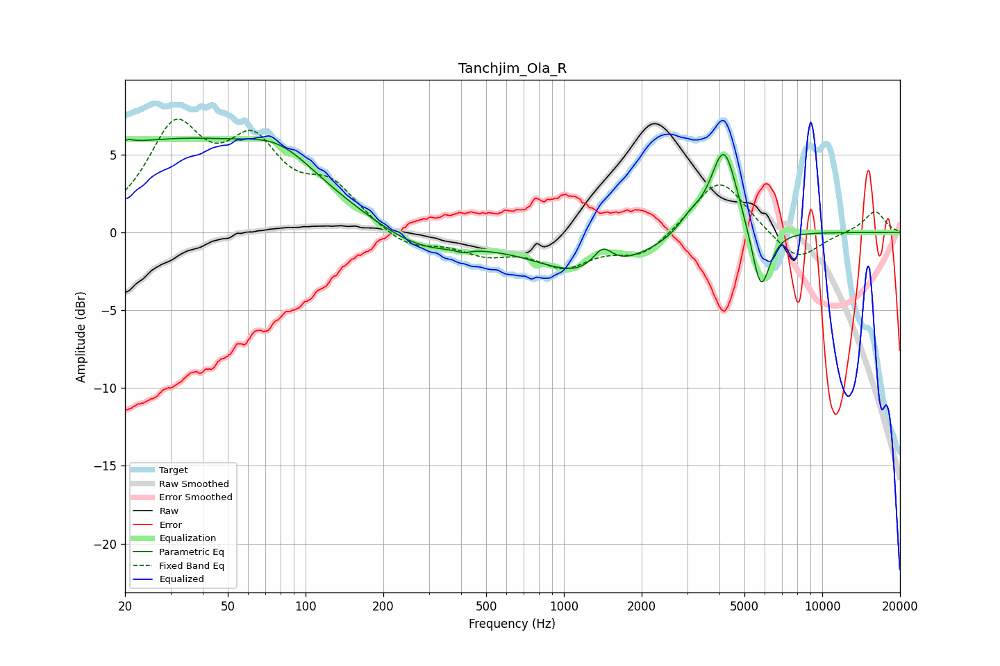

# Tanchjim_Ola_R
See [usage instructions](https://github.com/jaakkopasanen/AutoEq#usage) for more options and info.

### Parametric EQs
Apply preamp of -6.2 dB when using parametric equalizer.

|   # | Type    |   Fc (Hz) |    Q |   Gain (dB) |
|-----|---------|-----------|------|-------------|
|   1 | Peaking |        20 | 5.95 |         0.3 |
|   2 | Peaking |        29 | 0.27 |         5.8 |
|   3 | Peaking |        80 | 1.06 |         1.7 |
|   4 | Peaking |       276 | 0.83 |        -1.5 |
|   5 | Peaking |       408 | 5.94 |        -0.2 |
|   6 | Peaking |      1240 | 0.71 |        -2.7 |
|   7 | Peaking |      1412 | 3.6  |         1.4 |
|   8 | Peaking |      3082 | 2.98 |         0.9 |
|   9 | Peaking |      4165 | 2.64 |         5.7 |
|  10 | Peaking |      5787 | 3.88 |        -4.2 |

### Fixed Band EQs
When using fixed band (also called graphic) equalizer, apply preamp of **-7.4 dB** (if available) and set gains manually with these parameters.

|   # | Type    |   Fc (Hz) |    Q |   Gain (dB) |
|-----|---------|-----------|------|-------------|
|   1 | Peaking |        31 | 1.41 |         6.3 |
|   2 | Peaking |        62 | 1.41 |         4.9 |
|   3 | Peaking |       125 | 1.41 |         2.6 |
|   4 | Peaking |       250 | 1.41 |        -1.1 |
|   5 | Peaking |       500 | 1.41 |        -1.2 |
|   6 | Peaking |      1000 | 1.41 |        -2   |
|   7 | Peaking |      2000 | 1.41 |        -1.5 |
|   8 | Peaking |      4000 | 1.41 |         3.7 |
|   9 | Peaking |      8000 | 1.41 |        -1.9 |
|  10 | Peaking |     16000 | 1.41 |         1.4 |

### Graphs

