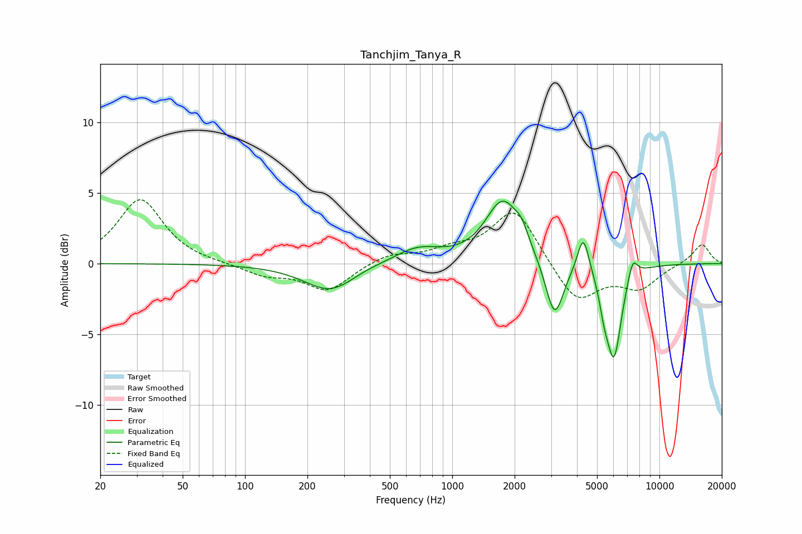

# Tanchjim_Tanya_R
See [usage instructions](https://github.com/jaakkopasanen/AutoEq#usage) for more options and info.

### Parametric EQs
Apply preamp of -4.5 dB when using parametric equalizer.

|   # | Type    |   Fc (Hz) |    Q |   Gain (dB) |
|-----|---------|-----------|------|-------------|
|   1 | Peaking |       259 | 1.11 |        -2   |
|   2 | Peaking |       376 | 1.55 |         0.2 |
|   3 | Peaking |       679 | 1.25 |         1.1 |
|   4 | Peaking |      1752 | 1.72 |         4.4 |
|   5 | Peaking |      2166 | 4.35 |         0.9 |
|   6 | Peaking |      3118 | 3.25 |        -4.2 |
|   7 | Peaking |      4291 | 5.04 |         2.7 |
|   8 | Peaking |      5409 | 6    |        -1.4 |
|   9 | Peaking |      6032 | 3.74 |        -6.5 |
|  10 | Peaking |      7422 | 5.74 |         1.5 |

### Fixed Band EQs
When using fixed band (also called graphic) equalizer, apply preamp of **-4.6 dB** (if available) and set gains manually with these parameters.

|   # | Type    |   Fc (Hz) |    Q |   Gain (dB) |
|-----|---------|-----------|------|-------------|
|   1 | Peaking |        31 | 1.41 |         4.6 |
|   2 | Peaking |        62 | 1.41 |        -0   |
|   3 | Peaking |       125 | 1.41 |        -0.8 |
|   4 | Peaking |       250 | 1.41 |        -1.9 |
|   5 | Peaking |       500 | 1.41 |         0.7 |
|   6 | Peaking |      1000 | 1.41 |         0.8 |
|   7 | Peaking |      2000 | 1.41 |         3.9 |
|   8 | Peaking |      4000 | 1.41 |        -2.8 |
|   9 | Peaking |      8000 | 1.41 |        -1.6 |
|  10 | Peaking |     16000 | 1.41 |         1.4 |

### Graphs

