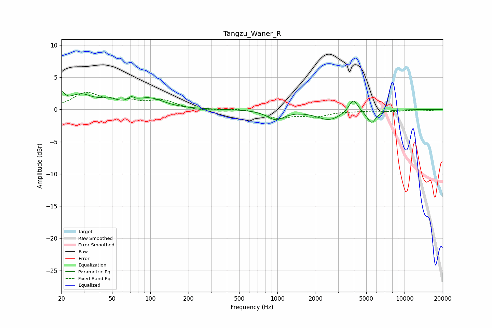

# Tangzu_Waner_R
See [usage instructions](https://github.com/jaakkopasanen/AutoEq#usage) for more options and info.

### Parametric EQs
Apply preamp of -2.9 dB when using parametric equalizer.

|   # | Type    |   Fc (Hz) |    Q |   Gain (dB) |
|-----|---------|-----------|------|-------------|
|   1 | Peaking |        20 | 5.94 |         1.7 |
|   2 | Peaking |        28 | 1.51 |         2.1 |
|   3 | Peaking |        47 | 2.25 |         0.9 |
|   4 | Peaking |        71 | 5.95 |         2   |
|   5 | Peaking |        71 | 5.79 |        -1.3 |
|   6 | Peaking |        98 | 1.26 |         1.6 |
|   7 | Peaking |       968 | 2.12 |        -1.5 |
|   8 | Peaking |      2557 | 1.44 |        -1.6 |
|   9 | Peaking |      3953 | 4.02 |         2.1 |
|  10 | Peaking |      5493 | 3.86 |        -2   |

### Fixed Band EQs
When using fixed band (also called graphic) equalizer, apply preamp of **-2.8 dB** (if available) and set gains manually with these parameters.

|   # | Type    |   Fc (Hz) |    Q |   Gain (dB) |
|-----|---------|-----------|------|-------------|
|   1 | Peaking |        31 | 1.41 |         2.4 |
|   2 | Peaking |        62 | 1.41 |         1.1 |
|   3 | Peaking |       125 | 1.41 |         1.3 |
|   4 | Peaking |       250 | 1.41 |        -0.3 |
|   5 | Peaking |       500 | 1.41 |         0.2 |
|   6 | Peaking |      1000 | 1.41 |        -1.2 |
|   7 | Peaking |      2000 | 1.41 |        -0.9 |
|   8 | Peaking |      4000 | 1.41 |        -0.2 |
|   9 | Peaking |      8000 | 1.41 |        -0.3 |
|  10 | Peaking |     16000 | 1.41 |        -0.1 |

### Graphs

