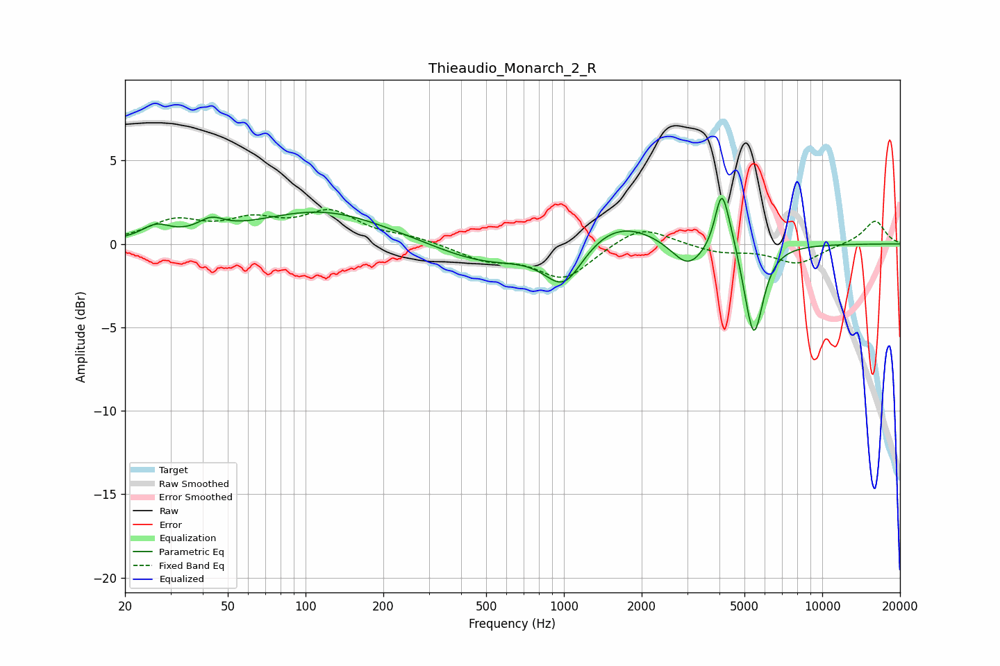

# Thieaudio_Monarch_2_R
See [usage instructions](https://github.com/jaakkopasanen/AutoEq#usage) for more options and info.

### Parametric EQs
Apply preamp of -2.8 dB when using parametric equalizer.

|   # | Type    |   Fc (Hz) |    Q |   Gain (dB) |
|-----|---------|-----------|------|-------------|
|   1 | Peaking |        26 | 2.63 |         0.8 |
|   2 | Peaking |        43 | 2.83 |         0.8 |
|   3 | Peaking |       116 | 0.55 |         2   |
|   4 | Peaking |       491 | 0.72 |        -1.3 |
|   5 | Peaking |      1001 | 1.87 |        -2.6 |
|   6 | Peaking |      1591 | 0.93 |         1.6 |
|   7 | Peaking |      3018 | 2.23 |        -1.6 |
|   8 | Peaking |      4079 | 5.42 |         3.3 |
|   9 | Peaking |      4439 | 4.12 |         0.9 |
|  10 | Peaking |      5430 | 3.8  |        -5.6 |

### Fixed Band EQs
When using fixed band (also called graphic) equalizer, apply preamp of **-2.2 dB** (if available) and set gains manually with these parameters.

|   # | Type    |   Fc (Hz) |    Q |   Gain (dB) |
|-----|---------|-----------|------|-------------|
|   1 | Peaking |        31 | 1.41 |         1.3 |
|   2 | Peaking |        62 | 1.41 |         1.2 |
|   3 | Peaking |       125 | 1.41 |         1.8 |
|   4 | Peaking |       250 | 1.41 |         0.3 |
|   5 | Peaking |       500 | 1.41 |        -0.9 |
|   6 | Peaking |      1000 | 1.41 |        -2.1 |
|   7 | Peaking |      2000 | 1.41 |         1.2 |
|   8 | Peaking |      4000 | 1.41 |        -0.5 |
|   9 | Peaking |      8000 | 1.41 |        -1.2 |
|  10 | Peaking |     16000 | 1.41 |         1.4 |

### Graphs

