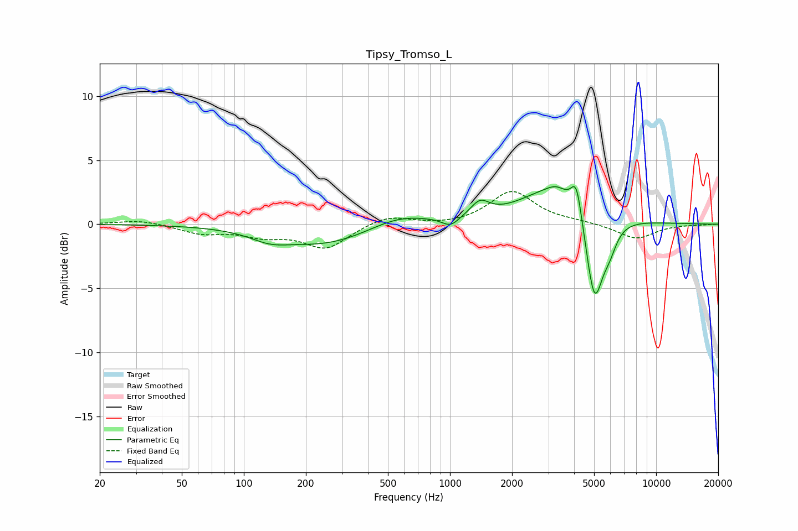

# Tipsy_Tromso_L
See [usage instructions](https://github.com/jaakkopasanen/AutoEq#usage) for more options and info.

### Parametric EQs
Apply preamp of -3.0 dB when using parametric equalizer.

|   # | Type    |   Fc (Hz) |    Q |   Gain (dB) |
|-----|---------|-----------|------|-------------|
|   1 | Peaking |       134 | 1.53 |        -0.7 |
|   2 | Peaking |       249 | 0.62 |        -1.6 |
|   3 | Peaking |       562 | 0.96 |         1   |
|   4 | Peaking |      1006 | 3.39 |        -0.7 |
|   5 | Peaking |      1397 | 3.13 |         1.2 |
|   6 | Peaking |      3276 | 3.37 |         0.4 |
|   7 | Peaking |      3278 | 0.84 |         2.9 |
|   8 | Peaking |      4107 | 5.47 |         2.6 |
|   9 | Peaking |      5018 | 3.26 |        -7.1 |
|  10 | Peaking |      5944 | 3.85 |        -1.5 |

### Fixed Band EQs
When using fixed band (also called graphic) equalizer, apply preamp of **-2.6 dB** (if available) and set gains manually with these parameters.

|   # | Type    |   Fc (Hz) |    Q |   Gain (dB) |
|-----|---------|-----------|------|-------------|
|   1 | Peaking |        31 | 1.41 |         0.4 |
|   2 | Peaking |        62 | 1.41 |        -0.7 |
|   3 | Peaking |       125 | 1.41 |        -0.8 |
|   4 | Peaking |       250 | 1.41 |        -1.8 |
|   5 | Peaking |       500 | 1.41 |         0.7 |
|   6 | Peaking |      1000 | 1.41 |        -0.1 |
|   7 | Peaking |      2000 | 1.41 |         2.6 |
|   8 | Peaking |      4000 | 1.41 |         0.2 |
|   9 | Peaking |      8000 | 1.41 |        -1.2 |
|  10 | Peaking |     16000 | 1.41 |        -0   |

### Graphs

