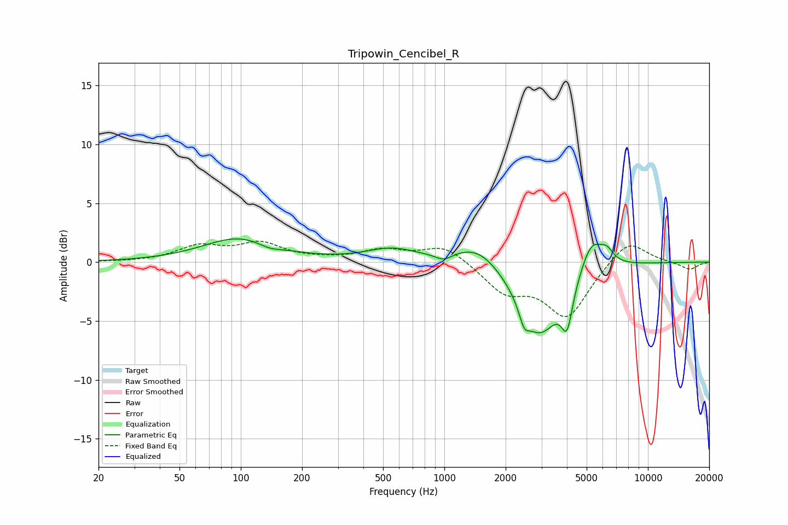

# Tripowin_Cencibel_R
See [usage instructions](https://github.com/jaakkopasanen/AutoEq#usage) for more options and info.

### Parametric EQs
Apply preamp of -2.1 dB when using parametric equalizer.

|   # | Type    |   Fc (Hz) |    Q |   Gain (dB) |
|-----|---------|-----------|------|-------------|
|   1 | Peaking |        98 | 0.8  |         2   |
|   2 | Peaking |       138 | 2.45 |        -0.4 |
|   3 | Peaking |       550 | 1.12 |         1   |
|   4 | Peaking |       992 | 3.48 |        -0.6 |
|   5 | Peaking |      1459 | 1.22 |         1.8 |
|   6 | Peaking |      2467 | 5.99 |        -1.3 |
|   7 | Peaking |      2933 | 1.34 |        -6.2 |
|   8 | Peaking |      4007 | 5.13 |        -3.4 |
|   9 | Peaking |      5291 | 2.53 |         2.8 |
|  10 | Peaking |      6289 | 4.26 |         0.9 |

### Fixed Band EQs
When using fixed band (also called graphic) equalizer, apply preamp of **-1.9 dB** (if available) and set gains manually with these parameters.

|   # | Type    |   Fc (Hz) |    Q |   Gain (dB) |
|-----|---------|-----------|------|-------------|
|   1 | Peaking |        31 | 1.41 |        -0   |
|   2 | Peaking |        62 | 1.41 |         1.3 |
|   3 | Peaking |       125 | 1.41 |         1.5 |
|   4 | Peaking |       250 | 1.41 |         0.1 |
|   5 | Peaking |       500 | 1.41 |         0.9 |
|   6 | Peaking |      1000 | 1.41 |         1.5 |
|   7 | Peaking |      2000 | 1.41 |        -2.4 |
|   8 | Peaking |      4000 | 1.41 |        -4.5 |
|   9 | Peaking |      8000 | 1.41 |         2.1 |
|  10 | Peaking |     16000 | 1.41 |        -0.6 |

### Graphs

