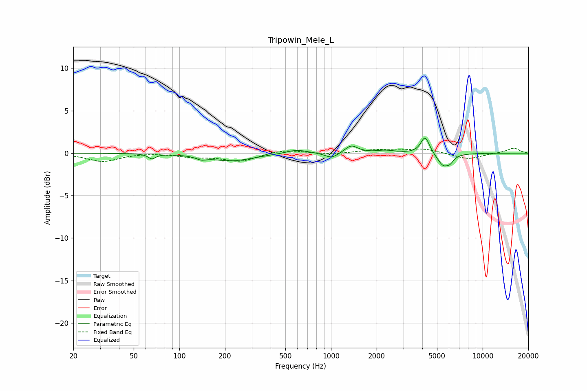

# Tripowin_Mele_L
See [usage instructions](https://github.com/jaakkopasanen/AutoEq#usage) for more options and info.

### Parametric EQs
Apply preamp of -1.9 dB when using parametric equalizer.

|   # | Type    |   Fc (Hz) |    Q |   Gain (dB) |
|-----|---------|-----------|------|-------------|
|   1 | Peaking |        66 | 6    |        -0.6 |
|   2 | Peaking |       139 | 4.36 |        -0.3 |
|   3 | Peaking |       221 | 1    |        -0.9 |
|   4 | Peaking |       594 | 2.02 |         0.5 |
|   5 | Peaking |      1009 | 3.28 |        -0.7 |
|   6 | Peaking |      1361 | 3.37 |         0.9 |
|   7 | Peaking |      2288 | 2.39 |         0.3 |
|   8 | Peaking |      4175 | 4.96 |         2   |
|   9 | Peaking |      5510 | 3.48 |        -1.5 |
|  10 | Peaking |      6112 | 6    |        -0.5 |

### Fixed Band EQs
When using fixed band (also called graphic) equalizer, apply preamp of **-0.7 dB** (if available) and set gains manually with these parameters.

|   # | Type    |   Fc (Hz) |    Q |   Gain (dB) |
|-----|---------|-----------|------|-------------|
|   1 | Peaking |        31 | 1.41 |        -1   |
|   2 | Peaking |        62 | 1.41 |         0.1 |
|   3 | Peaking |       125 | 1.41 |        -0.4 |
|   4 | Peaking |       250 | 1.41 |        -0.9 |
|   5 | Peaking |       500 | 1.41 |         0.4 |
|   6 | Peaking |      1000 | 1.41 |        -0.2 |
|   7 | Peaking |      2000 | 1.41 |         0.4 |
|   8 | Peaking |      4000 | 1.41 |         0.5 |
|   9 | Peaking |      8000 | 1.41 |        -0.7 |
|  10 | Peaking |     16000 | 1.41 |         0.6 |

### Graphs

