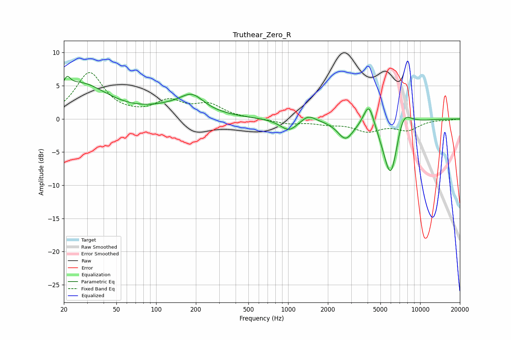

# Truthear_Zero_R
See [usage instructions](https://github.com/jaakkopasanen/AutoEq#usage) for more options and info.

### Parametric EQs
Apply preamp of -6.5 dB when using parametric equalizer.

|   # | Type    |   Fc (Hz) |    Q |   Gain (dB) |
|-----|---------|-----------|------|-------------|
|   1 | Peaking |        21 | 5.94 |         1.6 |
|   2 | Peaking |        26 | 0.69 |         5.2 |
|   3 | Peaking |       149 | 0.69 |         1.6 |
|   4 | Peaking |       188 | 1.69 |         2   |
|   5 | Peaking |      1014 | 2.16 |        -1.8 |
|   6 | Peaking |      1421 | 2.74 |         1   |
|   7 | Peaking |      2723 | 2.36 |        -2.8 |
|   8 | Peaking |      4091 | 3.47 |         3.9 |
|   9 | Peaking |      5989 | 2.3  |        -9.7 |
|  10 | Peaking |      7378 | 2.26 |         3.7 |

### Fixed Band EQs
When using fixed band (also called graphic) equalizer, apply preamp of **-7.1 dB** (if available) and set gains manually with these parameters.

|   # | Type    |   Fc (Hz) |    Q |   Gain (dB) |
|-----|---------|-----------|------|-------------|
|   1 | Peaking |        31 | 1.41 |         6.9 |
|   2 | Peaking |        62 | 1.41 |         0.2 |
|   3 | Peaking |       125 | 1.41 |         2.4 |
|   4 | Peaking |       250 | 1.41 |         2   |
|   5 | Peaking |       500 | 1.41 |        -0   |
|   6 | Peaking |      1000 | 1.41 |        -0.6 |
|   7 | Peaking |      2000 | 1.41 |        -0.6 |
|   8 | Peaking |      4000 | 1.41 |        -1.7 |
|   9 | Peaking |      8000 | 1.41 |        -1.5 |
|  10 | Peaking |     16000 | 1.41 |        -0.1 |

### Graphs

