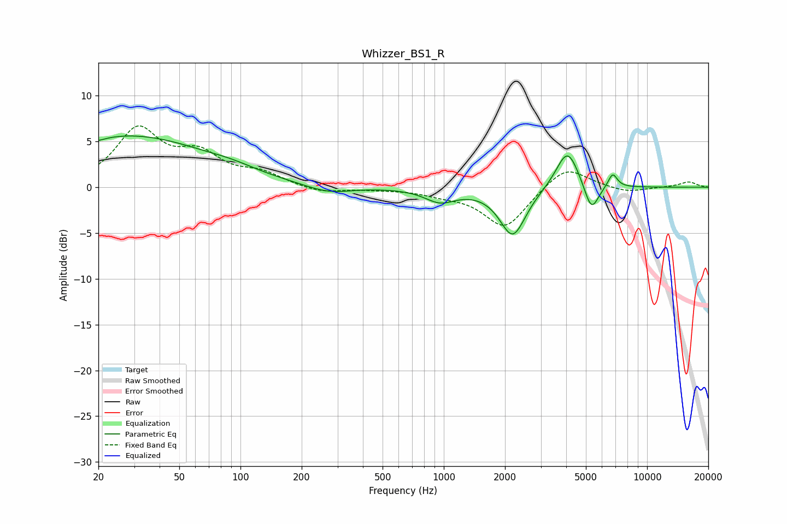

# Whizzer_BS1_R
See [usage instructions](https://github.com/jaakkopasanen/AutoEq#usage) for more options and info.

### Parametric EQs
Apply preamp of -5.7 dB when using parametric equalizer.

|   # | Type    |   Fc (Hz) |    Q |   Gain (dB) |
|-----|---------|-----------|------|-------------|
|   1 | Peaking |        20 | 5.85 |         3.3 |
|   2 | Peaking |        20 | 5.81 |        -3.4 |
|   3 | Peaking |        28 | 0.35 |         5.6 |
|   4 | Peaking |        91 | 1.25 |         0.4 |
|   5 | Peaking |       269 | 1.24 |        -0.9 |
|   6 | Peaking |       959 | 1.87 |        -1.4 |
|   7 | Peaking |      2185 | 2.21 |        -5.3 |
|   8 | Peaking |      4058 | 2.51 |         4.4 |
|   9 | Peaking |      5323 | 3.94 |        -3.2 |
|  10 | Peaking |      6771 | 6    |         1.6 |

### Fixed Band EQs
When using fixed band (also called graphic) equalizer, apply preamp of **-6.8 dB** (if available) and set gains manually with these parameters.

|   # | Type    |   Fc (Hz) |    Q |   Gain (dB) |
|-----|---------|-----------|------|-------------|
|   1 | Peaking |        31 | 1.41 |         6.1 |
|   2 | Peaking |        62 | 1.41 |         3.1 |
|   3 | Peaking |       125 | 1.41 |         1.3 |
|   4 | Peaking |       250 | 1.41 |        -0.7 |
|   5 | Peaking |       500 | 1.41 |        -0.1 |
|   6 | Peaking |      1000 | 1.41 |        -0.6 |
|   7 | Peaking |      2000 | 1.41 |        -4.4 |
|   8 | Peaking |      4000 | 1.41 |         2.5 |
|   9 | Peaking |      8000 | 1.41 |        -0.6 |
|  10 | Peaking |     16000 | 1.41 |         0.6 |

### Graphs

