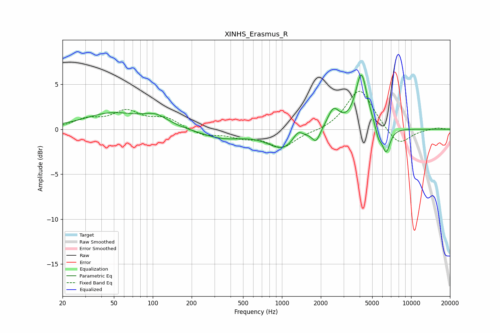

# XINHS_Erasmus_R
See [usage instructions](https://github.com/jaakkopasanen/AutoEq#usage) for more options and info.

### Parametric EQs
Apply preamp of -6.1 dB when using parametric equalizer.

|   # | Type    |   Fc (Hz) |    Q |   Gain (dB) |
|-----|---------|-----------|------|-------------|
|   1 | Peaking |        48 | 0.66 |         1.7 |
|   2 | Peaking |       106 | 1.48 |         1.1 |
|   3 | Peaking |       346 | 0.86 |        -1   |
|   4 | Peaking |      1021 | 1.22 |        -2.1 |
|   5 | Peaking |      1330 | 3.68 |         1.1 |
|   6 | Peaking |      1839 | 4.67 |        -1.3 |
|   7 | Peaking |      2506 | 3.05 |         2.2 |
|   8 | Peaking |      4121 | 3.13 |         6.2 |
|   9 | Peaking |      5596 | 6    |        -1.2 |
|  10 | Peaking |      6400 | 4.34 |        -2.8 |

### Fixed Band EQs
When using fixed band (also called graphic) equalizer, apply preamp of **-4.3 dB** (if available) and set gains manually with these parameters.

|   # | Type    |   Fc (Hz) |    Q |   Gain (dB) |
|-----|---------|-----------|------|-------------|
|   1 | Peaking |        31 | 1.41 |         1   |
|   2 | Peaking |        62 | 1.41 |         1.8 |
|   3 | Peaking |       125 | 1.41 |         1.2 |
|   4 | Peaking |       250 | 1.41 |        -0.7 |
|   5 | Peaking |       500 | 1.41 |        -0.8 |
|   6 | Peaking |      1000 | 1.41 |        -2   |
|   7 | Peaking |      2000 | 1.41 |        -0.2 |
|   8 | Peaking |      4000 | 1.41 |         4.6 |
|   9 | Peaking |      8000 | 1.41 |        -2   |
|  10 | Peaking |     16000 | 1.41 |         0.2 |

### Graphs

