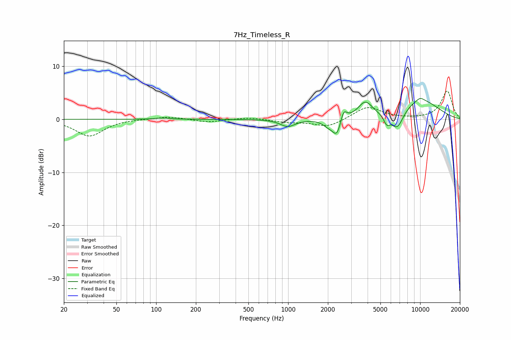

# 7Hz_Timeless_R
See [usage instructions](https://github.com/jaakkopasanen/AutoEq#usage) for more options and info.

### Parametric EQs
Apply preamp of -4.0 dB when using parametric equalizer.

|   # | Type    |   Fc (Hz) |    Q |   Gain (dB) |
|-----|---------|-----------|------|-------------|
|   1 | Peaking |       113 | 2.9  |         0.2 |
|   2 | Peaking |       992 | 2.57 |        -1.4 |
|   3 | Peaking |      2005 | 3.36 |        -1   |
|   4 | Peaking |      2342 | 4.19 |        -3.3 |
|   5 | Peaking |      2629 | 6    |         2.3 |
|   6 | Peaking |      3841 | 2.54 |         3   |
|   7 | Peaking |      5588 | 5.96 |        -1.6 |
|   8 | Peaking |      6702 | 2.8  |        -3.6 |
|   9 | Peaking |     10000 | 0.74 |         3.6 |
|  10 | Peaking |     10000 | 4.03 |         0.6 |

### Fixed Band EQs
When using fixed band (also called graphic) equalizer, apply preamp of **-5.4 dB** (if available) and set gains manually with these parameters.

|   # | Type    |   Fc (Hz) |    Q |   Gain (dB) |
|-----|---------|-----------|------|-------------|
|   1 | Peaking |        31 | 1.41 |        -3.2 |
|   2 | Peaking |        62 | 1.41 |         0.1 |
|   3 | Peaking |       125 | 1.41 |         0.5 |
|   4 | Peaking |       250 | 1.41 |        -0.6 |
|   5 | Peaking |       500 | 1.41 |         0.4 |
|   6 | Peaking |      1000 | 1.41 |        -0.5 |
|   7 | Peaking |      2000 | 1.41 |        -1.5 |
|   8 | Peaking |      4000 | 1.41 |         2.4 |
|   9 | Peaking |      8000 | 1.41 |         0   |
|  10 | Peaking |     16000 | 1.41 |         5.3 |

### Graphs

