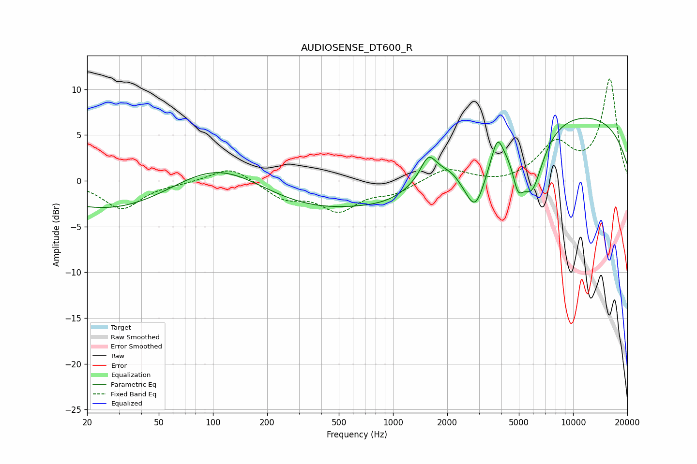

# AUDIOSENSE_DT600_R
See [usage instructions](https://github.com/jaakkopasanen/AutoEq#usage) for more options and info.

### Parametric EQs
Apply preamp of -6.9 dB when using parametric equalizer.

|   # | Type    |   Fc (Hz) |    Q |   Gain (dB) |
|-----|---------|-----------|------|-------------|
|   1 | Peaking |       101 | 0.18 |        -9.2 |
|   2 | Peaking |       105 | 0.39 |        10.1 |
|   3 | Peaking |      1027 | 0.78 |        -2   |
|   4 | Peaking |      1570 | 3.33 |         2.4 |
|   5 | Peaking |      2385 | 5.98 |        -0.2 |
|   6 | Peaking |      2857 | 2.14 |        -6.8 |
|   7 | Peaking |      3795 | 4.68 |         2.6 |
|   8 | Peaking |      4935 | 4.76 |        -3.1 |
|   9 | Peaking |      5888 | 2.04 |        -7.2 |
|  10 | Peaking |      8577 | 0.2  |         7.6 |

### Fixed Band EQs
When using fixed band (also called graphic) equalizer, apply preamp of **-11.2 dB** (if available) and set gains manually with these parameters.

|   # | Type    |   Fc (Hz) |    Q |   Gain (dB) |
|-----|---------|-----------|------|-------------|
|   1 | Peaking |        31 | 1.41 |        -3   |
|   2 | Peaking |        62 | 1.41 |        -0.2 |
|   3 | Peaking |       125 | 1.41 |         1.6 |
|   4 | Peaking |       250 | 1.41 |        -1.8 |
|   5 | Peaking |       500 | 1.41 |        -3   |
|   6 | Peaking |      1000 | 1.41 |        -1.2 |
|   7 | Peaking |      2000 | 1.41 |         1.4 |
|   8 | Peaking |      4000 | 1.41 |        -0.4 |
|   9 | Peaking |      8000 | 1.41 |         3.9 |
|  10 | Peaking |     16000 | 1.41 |        11   |

### Graphs

