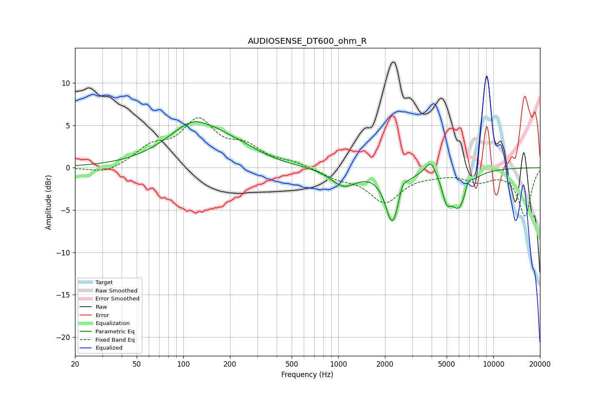

# AUDIOSENSE_DT600_ohm_R
See [usage instructions](https://github.com/jaakkopasanen/AutoEq#usage) for more options and info.

### Parametric EQs
Apply preamp of -5.5 dB when using parametric equalizer.

|   # | Type    |   Fc (Hz) |    Q |   Gain (dB) |
|-----|---------|-----------|------|-------------|
|   1 | Peaking |       123 | 0.78 |         5.4 |
|   2 | Peaking |       139 | 3.39 |        -0.2 |
|   3 | Peaking |       247 | 1.21 |         0.8 |
|   4 | Peaking |      1082 | 1.69 |        -2.1 |
|   5 | Peaking |      2234 | 3.23 |        -6.2 |
|   6 | Peaking |      2592 | 6    |         1.2 |
|   7 | Peaking |      3952 | 4.07 |         1.8 |
|   8 | Peaking |      4988 | 5.03 |        -2.3 |
|   9 | Peaking |      6008 | 2.42 |        -4.6 |
|  10 | Peaking |      6887 | 6    |         1.3 |

### Fixed Band EQs
When using fixed band (also called graphic) equalizer, apply preamp of **-6.0 dB** (if available) and set gains manually with these parameters.

|   # | Type    |   Fc (Hz) |    Q |   Gain (dB) |
|-----|---------|-----------|------|-------------|
|   1 | Peaking |        31 | 1.41 |        -0.8 |
|   2 | Peaking |        62 | 1.41 |         2.1 |
|   3 | Peaking |       125 | 1.41 |         5.2 |
|   4 | Peaking |       250 | 1.41 |         2.1 |
|   5 | Peaking |       500 | 1.41 |         0.5 |
|   6 | Peaking |      1000 | 1.41 |        -1   |
|   7 | Peaking |      2000 | 1.41 |        -3.9 |
|   8 | Peaking |      4000 | 1.41 |        -0.5 |
|   9 | Peaking |      8000 | 1.41 |        -1.4 |
|  10 | Peaking |     16000 | 1.41 |        -5.7 |

### Graphs

