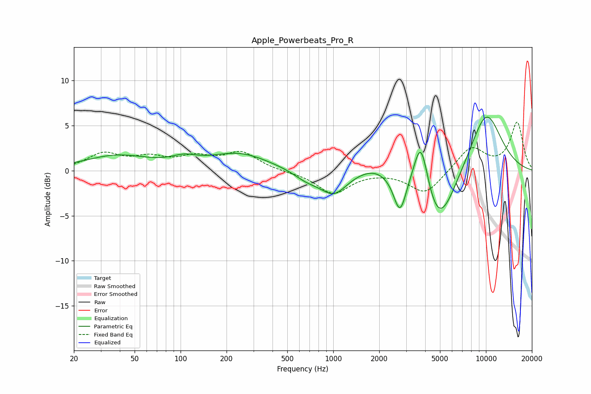

# Apple_Powerbeats_Pro_R
See [usage instructions](https://github.com/jaakkopasanen/AutoEq#usage) for more options and info.

### Parametric EQs
Apply preamp of -6.0 dB when using parametric equalizer.

|   # | Type    |   Fc (Hz) |    Q |   Gain (dB) |
|-----|---------|-----------|------|-------------|
|   1 | Peaking |        38 | 0.67 |         1.6 |
|   2 | Peaking |       105 | 1.7  |         0.8 |
|   3 | Peaking |       243 | 0.74 |         1.9 |
|   4 | Peaking |       668 | 1.63 |        -0.9 |
|   5 | Peaking |      1006 | 1.58 |        -2.5 |
|   6 | Peaking |      1858 | 1.21 |         0.9 |
|   7 | Peaking |      2733 | 3.43 |        -4.2 |
|   8 | Peaking |      3751 | 2.89 |         6.4 |
|   9 | Peaking |      4894 | 1.27 |        -6.9 |
|  10 | Peaking |     10000 | 1.11 |         6.8 |

### Fixed Band EQs
When using fixed band (also called graphic) equalizer, apply preamp of **-5.5 dB** (if available) and set gains manually with these parameters.

|   # | Type    |   Fc (Hz) |    Q |   Gain (dB) |
|-----|---------|-----------|------|-------------|
|   1 | Peaking |        31 | 1.41 |         1.8 |
|   2 | Peaking |        62 | 1.41 |         1.2 |
|   3 | Peaking |       125 | 1.41 |         1.3 |
|   4 | Peaking |       250 | 1.41 |         1.9 |
|   5 | Peaking |       500 | 1.41 |        -0.1 |
|   6 | Peaking |      1000 | 1.41 |        -2.5 |
|   7 | Peaking |      2000 | 1.41 |        -0   |
|   8 | Peaking |      4000 | 1.41 |        -2.6 |
|   9 | Peaking |      8000 | 1.41 |         2.6 |
|  10 | Peaking |     16000 | 1.41 |         5.3 |

### Graphs

