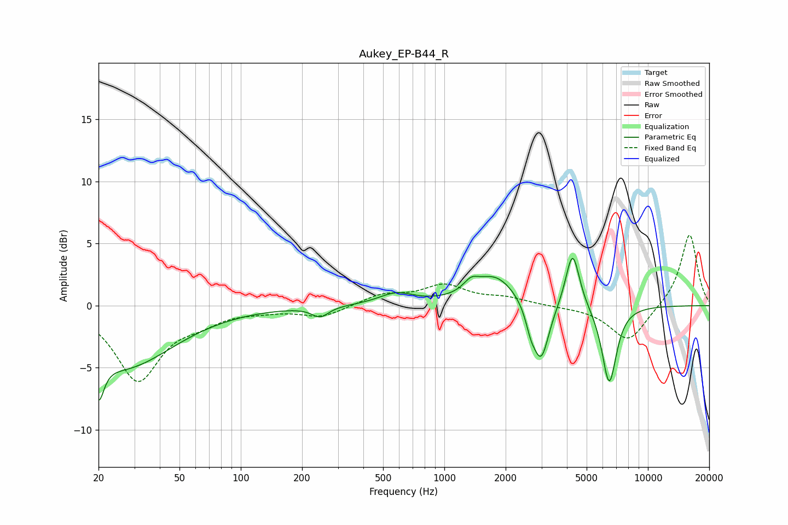

# Aukey_EP-B44_R
See [usage instructions](https://github.com/jaakkopasanen/AutoEq#usage) for more options and info.

### Parametric EQs
Apply preamp of -3.9 dB when using parametric equalizer.

|   # | Type    |   Fc (Hz) |    Q |   Gain (dB) |
|-----|---------|-----------|------|-------------|
|   1 | Peaking |        20 | 5.5  |        -3.2 |
|   2 | Peaking |        26 | 0.58 |        -4.9 |
|   3 | Peaking |       245 | 3.48 |        -0.8 |
|   4 | Peaking |       581 | 1.66 |         0.9 |
|   5 | Peaking |      1351 | 3.94 |         0.8 |
|   6 | Peaking |      1776 | 1.34 |         2.4 |
|   7 | Peaking |      2653 | 5.8  |        -1.3 |
|   8 | Peaking |      2984 | 3.52 |        -4.7 |
|   9 | Peaking |      4265 | 4.12 |         4.6 |
|  10 | Peaking |      6455 | 3.8  |        -6.4 |

### Fixed Band EQs
When using fixed band (also called graphic) equalizer, apply preamp of **-5.8 dB** (if available) and set gains manually with these parameters.

|   # | Type    |   Fc (Hz) |    Q |   Gain (dB) |
|-----|---------|-----------|------|-------------|
|   1 | Peaking |        31 | 1.41 |        -5.9 |
|   2 | Peaking |        62 | 1.41 |        -0.9 |
|   3 | Peaking |       125 | 1.41 |        -0.3 |
|   4 | Peaking |       250 | 1.41 |        -0.9 |
|   5 | Peaking |       500 | 1.41 |         0.8 |
|   6 | Peaking |      1000 | 1.41 |         1.5 |
|   7 | Peaking |      2000 | 1.41 |         0.5 |
|   8 | Peaking |      4000 | 1.41 |        -0.1 |
|   9 | Peaking |      8000 | 1.41 |        -2.9 |
|  10 | Peaking |     16000 | 1.41 |         5.8 |

### Graphs

