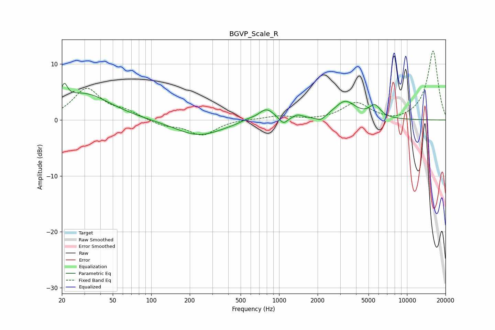

# BGVP_Scale_R
See [usage instructions](https://github.com/jaakkopasanen/AutoEq#usage) for more options and info.

### Parametric EQs
Apply preamp of -6.6 dB when using parametric equalizer.

|   # | Type    |   Fc (Hz) |    Q |   Gain (dB) |
|-----|---------|-----------|------|-------------|
|   1 | Peaking |        21 | 5.75 |         2.8 |
|   2 | Peaking |        30 | 0.69 |         4.7 |
|   3 | Peaking |       235 | 0.76 |        -2.8 |
|   4 | Peaking |       560 | 2.6  |         0.4 |
|   5 | Peaking |       794 | 2.34 |         2.2 |
|   6 | Peaking |      1080 | 4.58 |        -1.2 |
|   7 | Peaking |      1397 | 3.7  |         0.7 |
|   8 | Peaking |      2117 | 3.85 |        -0.9 |
|   9 | Peaking |      3279 | 1.69 |         3.3 |
|  10 | Peaking |      5609 | 3.22 |         2.1 |

### Fixed Band EQs
When using fixed band (also called graphic) equalizer, apply preamp of **-12.4 dB** (if available) and set gains manually with these parameters.

|   # | Type    |   Fc (Hz) |    Q |   Gain (dB) |
|-----|---------|-----------|------|-------------|
|   1 | Peaking |        31 | 1.41 |         5.5 |
|   2 | Peaking |        62 | 1.41 |         1.3 |
|   3 | Peaking |       125 | 1.41 |        -1   |
|   4 | Peaking |       250 | 1.41 |        -2.7 |
|   5 | Peaking |       500 | 1.41 |         0.2 |
|   6 | Peaking |      1000 | 1.41 |         0.7 |
|   7 | Peaking |      2000 | 1.41 |        -0.1 |
|   8 | Peaking |      4000 | 1.41 |         3   |
|   9 | Peaking |      8000 | 1.41 |        -0.5 |
|  10 | Peaking |     16000 | 1.41 |        12.4 |

### Graphs

