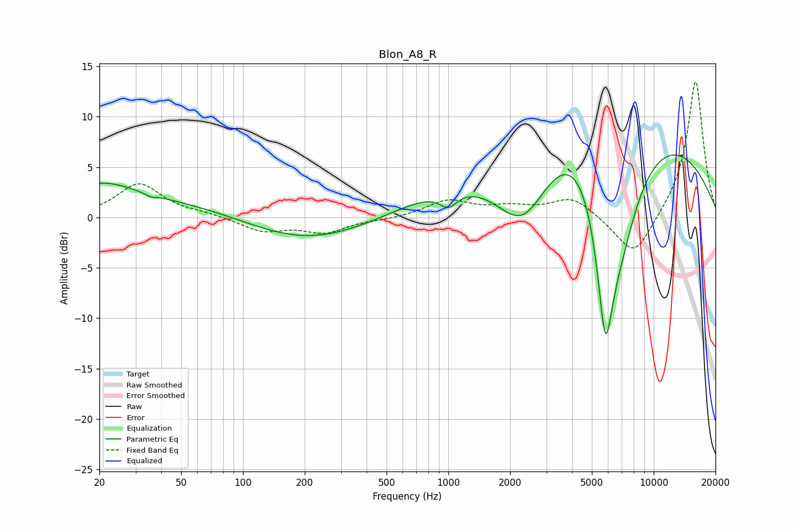

# Blon_A8_R
See [usage instructions](https://github.com/jaakkopasanen/AutoEq#usage) for more options and info.

### Parametric EQs
Apply preamp of -6.3 dB when using parametric equalizer.

|   # | Type    |   Fc (Hz) |    Q |   Gain (dB) |
|-----|---------|-----------|------|-------------|
|   1 | Peaking |        20 | 0.83 |         2.6 |
|   2 | Peaking |        36 | 5.45 |        -0.3 |
|   3 | Peaking |        54 | 0.34 |         1.6 |
|   4 | Peaking |       207 | 0.5  |        -4.5 |
|   5 | Peaking |       216 | 0.6  |         1.7 |
|   6 | Peaking |      1001 | 3.35 |        -1.5 |
|   7 | Peaking |      2312 | 0.87 |       -10   |
|   8 | Peaking |      5263 | 0.32 |        19.8 |
|   9 | Peaking |      5818 | 2.6  |       -17.3 |
|  10 | Peaking |      6819 | 0.96 |       -13.5 |

### Fixed Band EQs
When using fixed band (also called graphic) equalizer, apply preamp of **-13.6 dB** (if available) and set gains manually with these parameters.

|   # | Type    |   Fc (Hz) |    Q |   Gain (dB) |
|-----|---------|-----------|------|-------------|
|   1 | Peaking |        31 | 1.41 |         3.3 |
|   2 | Peaking |        62 | 1.41 |         0.3 |
|   3 | Peaking |       125 | 1.41 |        -1.3 |
|   4 | Peaking |       250 | 1.41 |        -1.4 |
|   5 | Peaking |       500 | 1.41 |        -0.2 |
|   6 | Peaking |      1000 | 1.41 |         1.6 |
|   7 | Peaking |      2000 | 1.41 |         0.8 |
|   8 | Peaking |      4000 | 1.41 |         2   |
|   9 | Peaking |      8000 | 1.41 |        -4.3 |
|  10 | Peaking |     16000 | 1.41 |        13.8 |

### Graphs

