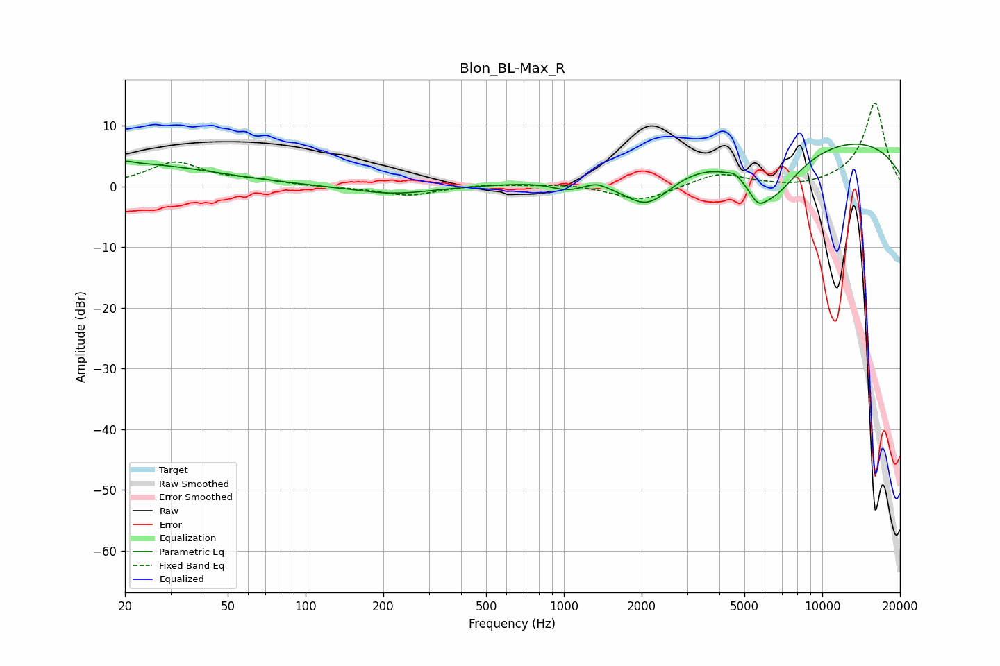

# Blon_BL-Max_R
See [usage instructions](https://github.com/jaakkopasanen/AutoEq#usage) for more options and info.

### Parametric EQs
Apply preamp of -7.1 dB when using parametric equalizer.

|   # | Type    |   Fc (Hz) |    Q |   Gain (dB) |
|-----|---------|-----------|------|-------------|
|   1 | Peaking |        20 | 5.58 |         0.4 |
|   2 | Peaking |        21 | 0.44 |         3.8 |
|   3 | Peaking |       218 | 0.91 |        -1.3 |
|   4 | Peaking |      1030 | 2.2  |        -1.5 |
|   5 | Peaking |      1341 | 4.66 |         0.5 |
|   6 | Peaking |      2103 | 1.27 |        -7.4 |
|   7 | Peaking |      4608 | 5.77 |         0.7 |
|   8 | Peaking |      5628 | 4.19 |        -2.4 |
|   9 | Peaking |      6353 | 1.13 |        -9.5 |
|  10 | Peaking |      7982 | 0.18 |         9.2 |

### Fixed Band EQs
When using fixed band (also called graphic) equalizer, apply preamp of **-13.9 dB** (if available) and set gains manually with these parameters.

|   # | Type    |   Fc (Hz) |    Q |   Gain (dB) |
|-----|---------|-----------|------|-------------|
|   1 | Peaking |        31 | 1.41 |         3.9 |
|   2 | Peaking |        62 | 1.41 |         0.8 |
|   3 | Peaking |       125 | 1.41 |        -0.1 |
|   4 | Peaking |       250 | 1.41 |        -1.5 |
|   5 | Peaking |       500 | 1.41 |         0.4 |
|   6 | Peaking |      1000 | 1.41 |         0.5 |
|   7 | Peaking |      2000 | 1.41 |        -2.5 |
|   8 | Peaking |      4000 | 1.41 |         2.2 |
|   9 | Peaking |      8000 | 1.41 |        -0.5 |
|  10 | Peaking |     16000 | 1.41 |        13.9 |

### Graphs

