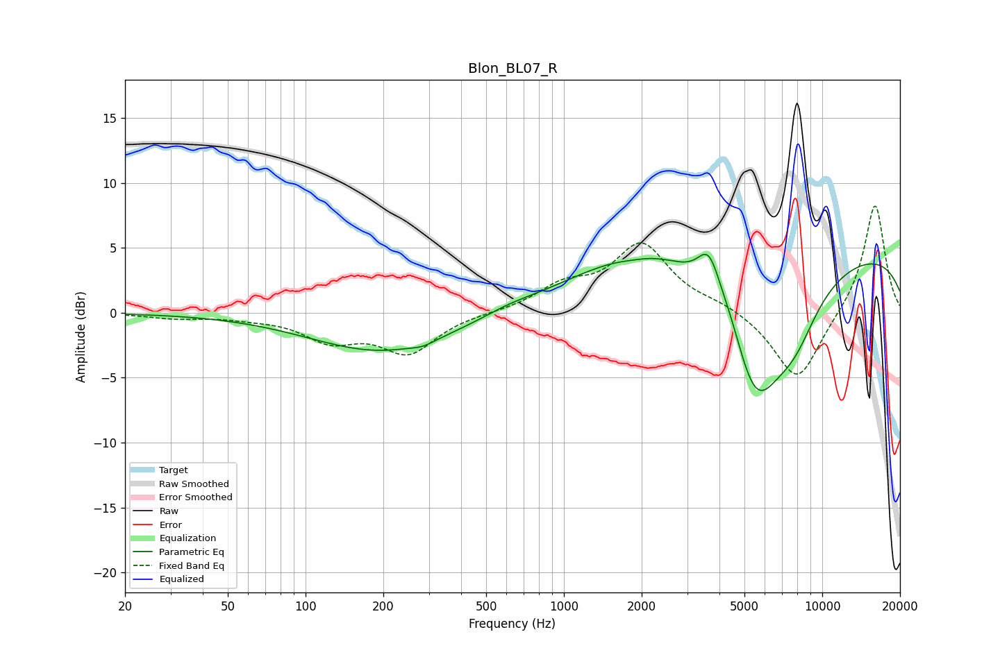

# Blon_BL07_R
See [usage instructions](https://github.com/jaakkopasanen/AutoEq#usage) for more options and info.

### Parametric EQs
Apply preamp of -4.6 dB when using parametric equalizer.

|   # | Type    |   Fc (Hz) |    Q |   Gain (dB) |
|-----|---------|-----------|------|-------------|
|   1 | Peaking |       201 | 0.5  |        -3   |
|   2 | Peaking |       284 | 3.35 |        -0.3 |
|   3 | Peaking |       611 | 1.48 |         0.3 |
|   4 | Peaking |      1823 | 2.43 |        -0.2 |
|   5 | Peaking |      2251 | 0.44 |         3.8 |
|   6 | Peaking |      3640 | 3.17 |         3.2 |
|   7 | Peaking |      4451 | 2.03 |         2.2 |
|   8 | Peaking |      5452 | 1.03 |       -12.7 |
|   9 | Peaking |      7841 | 1.53 |        -2.8 |
|  10 | Peaking |      9953 | 0.18 |         5   |

### Fixed Band EQs
When using fixed band (also called graphic) equalizer, apply preamp of **-8.3 dB** (if available) and set gains manually with these parameters.

|   # | Type    |   Fc (Hz) |    Q |   Gain (dB) |
|-----|---------|-----------|------|-------------|
|   1 | Peaking |        31 | 1.41 |        -0.4 |
|   2 | Peaking |        62 | 1.41 |        -0.3 |
|   3 | Peaking |       125 | 1.41 |        -1.9 |
|   4 | Peaking |       250 | 1.41 |        -3   |
|   5 | Peaking |       500 | 1.41 |         0   |
|   6 | Peaking |      1000 | 1.41 |         1.8 |
|   7 | Peaking |      2000 | 1.41 |         5.1 |
|   8 | Peaking |      4000 | 1.41 |         0.6 |
|   9 | Peaking |      8000 | 1.41 |        -5.4 |
|  10 | Peaking |     16000 | 1.41 |         8.5 |

### Graphs

