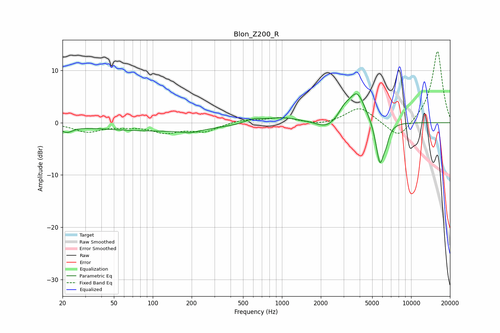

# Blon_Z200_R
See [usage instructions](https://github.com/jaakkopasanen/AutoEq#usage) for more options and info.

### Parametric EQs
Apply preamp of -5.6 dB when using parametric equalizer.

|   # | Type    |   Fc (Hz) |    Q |   Gain (dB) |
|-----|---------|-----------|------|-------------|
|   1 | Peaking |        21 | 3.03 |        -1.3 |
|   2 | Peaking |       106 | 0.27 |        -1.5 |
|   3 | Peaking |       195 | 1.99 |        -0.6 |
|   4 | Peaking |       598 | 2.2  |         0.8 |
|   5 | Peaking |      1001 | 1.05 |         1.1 |
|   6 | Peaking |      2231 | 1.77 |        -1.6 |
|   7 | Peaking |      3037 | 3.16 |         1.5 |
|   8 | Peaking |      3816 | 2.14 |         5.8 |
|   9 | Peaking |      5730 | 4.32 |        -8.3 |
|  10 | Peaking |      6392 | 6    |        -1.9 |

### Fixed Band EQs
When using fixed band (also called graphic) equalizer, apply preamp of **-13.7 dB** (if available) and set gains manually with these parameters.

|   # | Type    |   Fc (Hz) |    Q |   Gain (dB) |
|-----|---------|-----------|------|-------------|
|   1 | Peaking |        31 | 1.41 |        -1.7 |
|   2 | Peaking |        62 | 1.41 |        -0.4 |
|   3 | Peaking |       125 | 1.41 |        -1.7 |
|   4 | Peaking |       250 | 1.41 |        -1.6 |
|   5 | Peaking |       500 | 1.41 |         0.6 |
|   6 | Peaking |      1000 | 1.41 |         0.9 |
|   7 | Peaking |      2000 | 1.41 |        -0.6 |
|   8 | Peaking |      4000 | 1.41 |         3   |
|   9 | Peaking |      8000 | 1.41 |        -3.4 |
|  10 | Peaking |     16000 | 1.41 |        13.9 |

### Graphs

