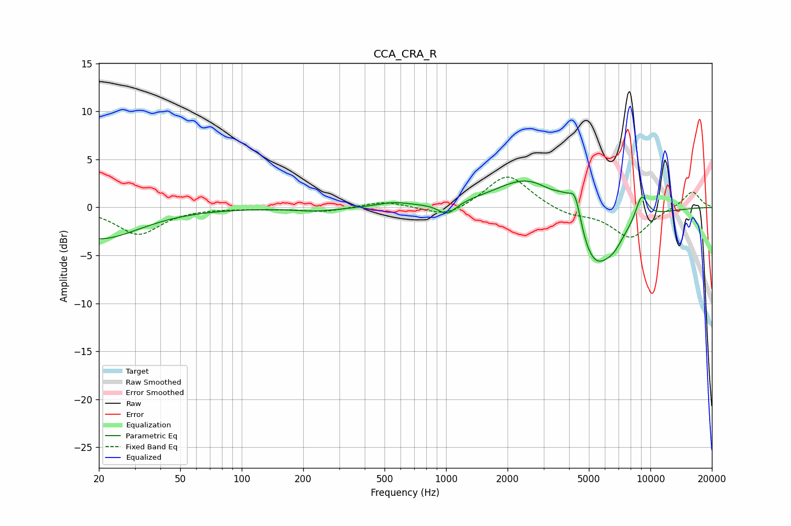

# CCA_CRA_R
See [usage instructions](https://github.com/jaakkopasanen/AutoEq#usage) for more options and info.

### Parametric EQs
Apply preamp of -2.8 dB when using parametric equalizer.

|   # | Type    |   Fc (Hz) |    Q |   Gain (dB) |
|-----|---------|-----------|------|-------------|
|   1 | Peaking |        20 | 0.72 |        -3.3 |
|   2 | Peaking |       234 | 1.29 |        -0.4 |
|   3 | Peaking |       552 | 1.88 |         0.4 |
|   4 | Peaking |      1013 | 3.23 |        -1.3 |
|   5 | Peaking |      2628 | 0.86 |         3.9 |
|   6 | Peaking |      3770 | 2.79 |         1.6 |
|   7 | Peaking |      4290 | 4.52 |         3.6 |
|   8 | Peaking |      5275 | 1.2  |        -7.6 |
|   9 | Peaking |      6656 | 3.63 |        -0.7 |
|  10 | Peaking |      9061 | 4.14 |         2.8 |

### Fixed Band EQs
When using fixed band (also called graphic) equalizer, apply preamp of **-3.2 dB** (if available) and set gains manually with these parameters.

|   # | Type    |   Fc (Hz) |    Q |   Gain (dB) |
|-----|---------|-----------|------|-------------|
|   1 | Peaking |        31 | 1.41 |        -2.8 |
|   2 | Peaking |        62 | 1.41 |        -0   |
|   3 | Peaking |       125 | 1.41 |        -0.1 |
|   4 | Peaking |       250 | 1.41 |        -0.5 |
|   5 | Peaking |       500 | 1.41 |         0.7 |
|   6 | Peaking |      1000 | 1.41 |        -1.2 |
|   7 | Peaking |      2000 | 1.41 |         3.6 |
|   8 | Peaking |      4000 | 1.41 |        -0.8 |
|   9 | Peaking |      8000 | 1.41 |        -3.2 |
|  10 | Peaking |     16000 | 1.41 |         1.7 |

### Graphs

