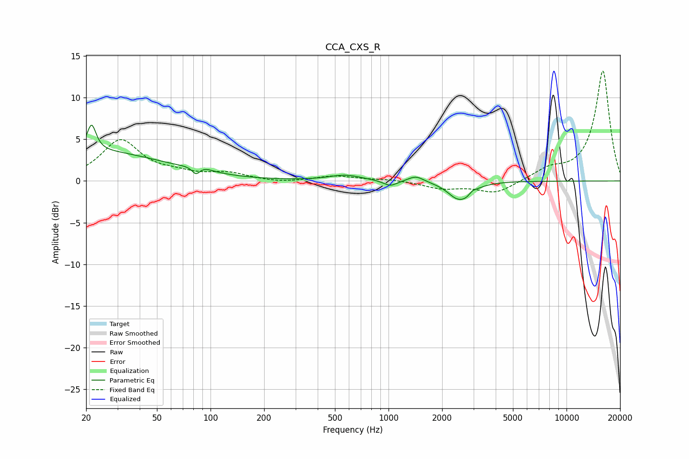

# CCA_CXS_R
See [usage instructions](https://github.com/jaakkopasanen/AutoEq#usage) for more options and info.

### Parametric EQs
Apply preamp of -6.8 dB when using parametric equalizer.

|   # | Type    |   Fc (Hz) |    Q |   Gain (dB) |
|-----|---------|-----------|------|-------------|
|   1 | Peaking |        21 | 5.75 |         3.2 |
|   2 | Peaking |        22 | 0.37 |         3.5 |
|   3 | Peaking |        83 | 6    |        -1.2 |
|   4 | Peaking |        87 | 2.65 |         0.7 |
|   5 | Peaking |       572 | 1.57 |         0.7 |
|   6 | Peaking |      1022 | 3.65 |        -0.7 |
|   7 | Peaking |      1425 | 3.32 |         0.7 |
|   8 | Peaking |      2455 | 2.41 |        -1.9 |
|   9 | Peaking |      2878 | 3.98 |        -1.5 |
|  10 | Peaking |      2932 | 5.33 |         1.2 |

### Fixed Band EQs
When using fixed band (also called graphic) equalizer, apply preamp of **-13.3 dB** (if available) and set gains manually with these parameters.

|   # | Type    |   Fc (Hz) |    Q |   Gain (dB) |
|-----|---------|-----------|------|-------------|
|   1 | Peaking |        31 | 1.41 |         4.8 |
|   2 | Peaking |        62 | 1.41 |         0.7 |
|   3 | Peaking |       125 | 1.41 |         0.9 |
|   4 | Peaking |       250 | 1.41 |        -0.3 |
|   5 | Peaking |       500 | 1.41 |         0.6 |
|   6 | Peaking |      1000 | 1.41 |         0.2 |
|   7 | Peaking |      2000 | 1.41 |        -0.9 |
|   8 | Peaking |      4000 | 1.41 |        -1.5 |
|   9 | Peaking |      8000 | 1.41 |         1.2 |
|  10 | Peaking |     16000 | 1.41 |        13.3 |

### Graphs

