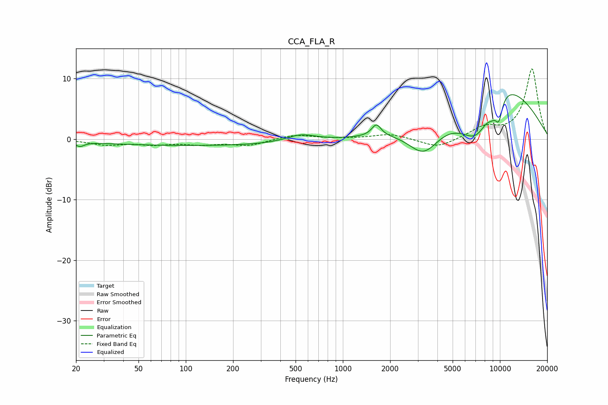

# CCA_FLA_R
See [usage instructions](https://github.com/jaakkopasanen/AutoEq#usage) for more options and info.

### Parametric EQs
Apply preamp of -7.4 dB when using parametric equalizer.

|   # | Type    |   Fc (Hz) |    Q |   Gain (dB) |
|-----|---------|-----------|------|-------------|
|   1 | Peaking |        21 | 5.35 |        -0.7 |
|   2 | Peaking |       130 | 0.18 |        -1.1 |
|   3 | Peaking |       532 | 1.64 |        -0.6 |
|   4 | Peaking |       538 | 1.52 |         1.9 |
|   5 | Peaking |      1636 | 4.78 |         2   |
|   6 | Peaking |      3272 | 1.4  |        -5   |
|   7 | Peaking |      7157 | 1.01 |       -11.2 |
|   8 | Peaking |      8828 | 0.47 |        14.3 |
|   9 | Peaking |      8899 | 4.04 |        -1.4 |
|  10 | Peaking |      9837 | 5.09 |        -3.7 |

### Fixed Band EQs
When using fixed band (also called graphic) equalizer, apply preamp of **-11.7 dB** (if available) and set gains manually with these parameters.

|   # | Type    |   Fc (Hz) |    Q |   Gain (dB) |
|-----|---------|-----------|------|-------------|
|   1 | Peaking |        31 | 1.41 |        -0.9 |
|   2 | Peaking |        62 | 1.41 |        -0.7 |
|   3 | Peaking |       125 | 1.41 |        -0.7 |
|   4 | Peaking |       250 | 1.41 |        -1   |
|   5 | Peaking |       500 | 1.41 |         0.8 |
|   6 | Peaking |      1000 | 1.41 |         0.1 |
|   7 | Peaking |      2000 | 1.41 |         0.9 |
|   8 | Peaking |      4000 | 1.41 |        -1.5 |
|   9 | Peaking |      8000 | 1.41 |         1.8 |
|  10 | Peaking |     16000 | 1.41 |        11.6 |

### Graphs

