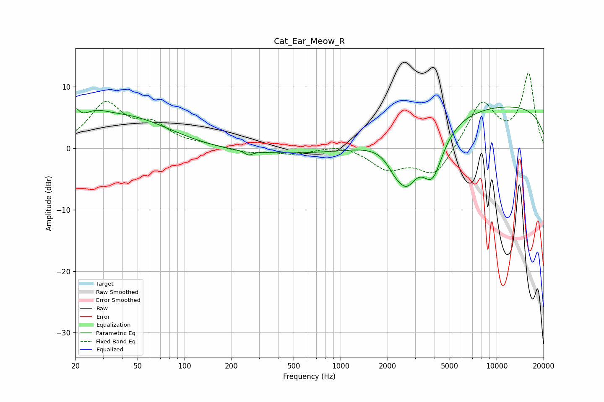

# Cat_Ear_Meow_R
See [usage instructions](https://github.com/jaakkopasanen/AutoEq#usage) for more options and info.

### Parametric EQs
Apply preamp of -6.8 dB when using parametric equalizer.

|   # | Type    |   Fc (Hz) |    Q |   Gain (dB) |
|-----|---------|-----------|------|-------------|
|   1 | Peaking |        20 | 6    |         2.3 |
|   2 | Peaking |        26 | 1.54 |         2.2 |
|   3 | Peaking |        43 | 0.51 |         4.9 |
|   4 | Peaking |       257 | 5.84 |        -0.7 |
|   5 | Peaking |       585 | 0.18 |        -1.1 |
|   6 | Peaking |      2246 | 2.44 |        -2.6 |
|   7 | Peaking |      2666 | 2.14 |        -5.8 |
|   8 | Peaking |      3874 | 1.96 |        -8.1 |
|   9 | Peaking |     10000 | 0.22 |         1.4 |
|  10 | Peaking |     10000 | 0.18 |         5.7 |

### Fixed Band EQs
When using fixed band (also called graphic) equalizer, apply preamp of **-12.3 dB** (if available) and set gains manually with these parameters.

|   # | Type    |   Fc (Hz) |    Q |   Gain (dB) |
|-----|---------|-----------|------|-------------|
|   1 | Peaking |        31 | 1.41 |         7   |
|   2 | Peaking |        62 | 1.41 |         3.2 |
|   3 | Peaking |       125 | 1.41 |         0.4 |
|   4 | Peaking |       250 | 1.41 |        -0.7 |
|   5 | Peaking |       500 | 1.41 |        -0.9 |
|   6 | Peaking |      1000 | 1.41 |         0.7 |
|   7 | Peaking |      2000 | 1.41 |        -3.2 |
|   8 | Peaking |      4000 | 1.41 |        -4.6 |
|   9 | Peaking |      8000 | 1.41 |         7.5 |
|  10 | Peaking |     16000 | 1.41 |        11.9 |

### Graphs

