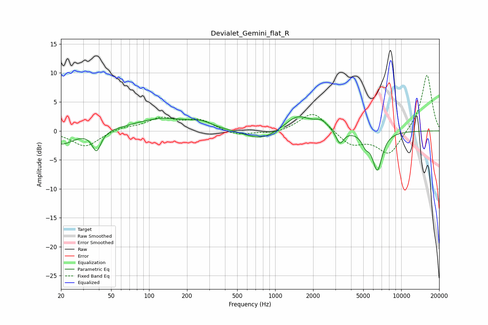

# Devialet_Gemini_flat_R
See [usage instructions](https://github.com/jaakkopasanen/AutoEq#usage) for more options and info.

### Parametric EQs
Apply preamp of -2.5 dB when using parametric equalizer.

|   # | Type    |   Fc (Hz) |    Q |   Gain (dB) |
|-----|---------|-----------|------|-------------|
|   1 | Peaking |        20 | 1.42 |        -2.3 |
|   2 | Peaking |        38 | 4.16 |        -3.4 |
|   3 | Peaking |       130 | 0.63 |         2.1 |
|   4 | Peaking |       263 | 1.79 |         0.8 |
|   5 | Peaking |       774 | 1.12 |        -1.8 |
|   6 | Peaking |      1505 | 1.42 |         2.7 |
|   7 | Peaking |      2320 | 2.59 |         1.3 |
|   8 | Peaking |      3259 | 4.62 |        -2.4 |
|   9 | Peaking |      5204 | 4.81 |        -1.6 |
|  10 | Peaking |      6459 | 3.48 |        -6.6 |

### Fixed Band EQs
When using fixed band (also called graphic) equalizer, apply preamp of **-9.7 dB** (if available) and set gains manually with these parameters.

|   # | Type    |   Fc (Hz) |    Q |   Gain (dB) |
|-----|---------|-----------|------|-------------|
|   1 | Peaking |        31 | 1.41 |        -2.8 |
|   2 | Peaking |        62 | 1.41 |         0.6 |
|   3 | Peaking |       125 | 1.41 |         2   |
|   4 | Peaking |       250 | 1.41 |         1.8 |
|   5 | Peaking |       500 | 1.41 |        -0.9 |
|   6 | Peaking |      1000 | 1.41 |        -0.5 |
|   7 | Peaking |      2000 | 1.41 |         3.4 |
|   8 | Peaking |      4000 | 1.41 |        -2.5 |
|   9 | Peaking |      8000 | 1.41 |        -4.1 |
|  10 | Peaking |     16000 | 1.41 |         9.9 |

### Graphs

