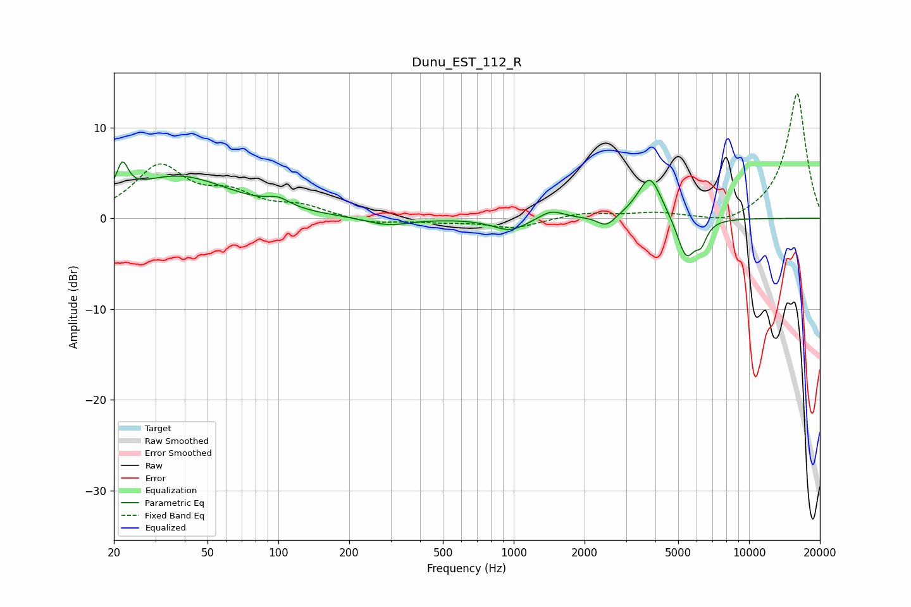

# Dunu_EST_112_R
See [usage instructions](https://github.com/jaakkopasanen/AutoEq#usage) for more options and info.

### Parametric EQs
Apply preamp of -6.3 dB when using parametric equalizer.

|   # | Type    |   Fc (Hz) |    Q |   Gain (dB) |
|-----|---------|-----------|------|-------------|
|   1 | Peaking |        22 | 5.93 |         3.2 |
|   2 | Peaking |        38 | 0.63 |         4.6 |
|   3 | Peaking |       100 | 2.86 |         0.9 |
|   4 | Peaking |       292 | 1.51 |        -0.9 |
|   5 | Peaking |       964 | 1.98 |        -1.4 |
|   6 | Peaking |      1443 | 2.74 |         1   |
|   7 | Peaking |      2476 | 3.75 |        -1.2 |
|   8 | Peaking |      3787 | 2.73 |         4.9 |
|   9 | Peaking |      5410 | 3.54 |        -4.6 |
|  10 | Peaking |      6264 | 6    |        -1.8 |

### Fixed Band EQs
When using fixed band (also called graphic) equalizer, apply preamp of **-13.8 dB** (if available) and set gains manually with these parameters.

|   # | Type    |   Fc (Hz) |    Q |   Gain (dB) |
|-----|---------|-----------|------|-------------|
|   1 | Peaking |        31 | 1.41 |         5.5 |
|   2 | Peaking |        62 | 1.41 |         2.3 |
|   3 | Peaking |       125 | 1.41 |         1.2 |
|   4 | Peaking |       250 | 1.41 |        -0.6 |
|   5 | Peaking |       500 | 1.41 |        -0.3 |
|   6 | Peaking |      1000 | 1.41 |        -1.1 |
|   7 | Peaking |      2000 | 1.41 |         0.6 |
|   8 | Peaking |      4000 | 1.41 |         0.5 |
|   9 | Peaking |      8000 | 1.41 |        -0.9 |
|  10 | Peaking |     16000 | 1.41 |        13.9 |

### Graphs

