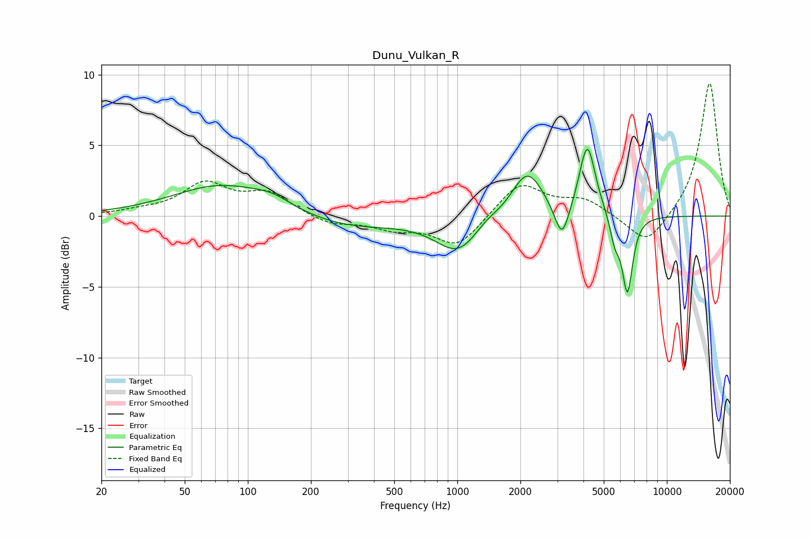

# Dunu_Vulkan_R
See [usage instructions](https://github.com/jaakkopasanen/AutoEq#usage) for more options and info.

### Parametric EQs
Apply preamp of -4.8 dB when using parametric equalizer.

|   # | Type    |   Fc (Hz) |    Q |   Gain (dB) |
|-----|---------|-----------|------|-------------|
|   1 | Peaking |        75 | 0.61 |         2.2 |
|   2 | Peaking |       132 | 1.5  |         0.6 |
|   3 | Peaking |       293 | 0.56 |        -0.9 |
|   4 | Peaking |      1009 | 1.33 |        -2.5 |
|   5 | Peaking |      1367 | 2.47 |         0.4 |
|   6 | Peaking |      2161 | 1.88 |         3.3 |
|   7 | Peaking |      3160 | 4.06 |        -2.6 |
|   8 | Peaking |      4176 | 3.66 |         5.1 |
|   9 | Peaking |      5647 | 5.99 |        -1.7 |
|  10 | Peaking |      6484 | 5.42 |        -5.4 |

### Fixed Band EQs
When using fixed band (also called graphic) equalizer, apply preamp of **-9.5 dB** (if available) and set gains manually with these parameters.

|   # | Type    |   Fc (Hz) |    Q |   Gain (dB) |
|-----|---------|-----------|------|-------------|
|   1 | Peaking |        31 | 1.41 |         0.3 |
|   2 | Peaking |        62 | 1.41 |         2.2 |
|   3 | Peaking |       125 | 1.41 |         1.5 |
|   4 | Peaking |       250 | 1.41 |        -0.6 |
|   5 | Peaking |       500 | 1.41 |        -0.8 |
|   6 | Peaking |      1000 | 1.41 |        -2.2 |
|   7 | Peaking |      2000 | 1.41 |         2.4 |
|   8 | Peaking |      4000 | 1.41 |         1.1 |
|   9 | Peaking |      8000 | 1.41 |        -2.2 |
|  10 | Peaking |     16000 | 1.41 |         9.5 |

### Graphs

