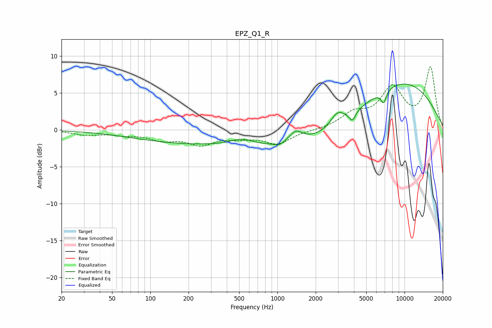

# EPZ_Q1_R
See [usage instructions](https://github.com/jaakkopasanen/AutoEq#usage) for more options and info.

### Parametric EQs
Apply preamp of -6.3 dB when using parametric equalizer.

|   # | Type    |   Fc (Hz) |    Q |   Gain (dB) |
|-----|---------|-----------|------|-------------|
|   1 | Peaking |       248 | 0.27 |        -1.8 |
|   2 | Peaking |       523 | 1.45 |         1   |
|   3 | Peaking |      1040 | 3.53 |        -0.4 |
|   4 | Peaking |      1393 | 2.58 |         1.6 |
|   5 | Peaking |      2054 | 0.35 |        -2.3 |
|   6 | Peaking |      2967 | 2.66 |         1.7 |
|   7 | Peaking |      3887 | 6    |        -1.3 |
|   8 | Peaking |      6865 | 5.95 |        -1.8 |
|   9 | Peaking |      7262 | 5.01 |         0.2 |
|  10 | Peaking |      9065 | 0.36 |         6.8 |

### Fixed Band EQs
When using fixed band (also called graphic) equalizer, apply preamp of **-8.6 dB** (if available) and set gains manually with these parameters.

|   # | Type    |   Fc (Hz) |    Q |   Gain (dB) |
|-----|---------|-----------|------|-------------|
|   1 | Peaking |        31 | 1.41 |        -0.6 |
|   2 | Peaking |        62 | 1.41 |        -0.5 |
|   3 | Peaking |       125 | 1.41 |        -1.2 |
|   4 | Peaking |       250 | 1.41 |        -1.8 |
|   5 | Peaking |       500 | 1.41 |        -0.8 |
|   6 | Peaking |      1000 | 1.41 |        -1.8 |
|   7 | Peaking |      2000 | 1.41 |        -0.1 |
|   8 | Peaking |      4000 | 1.41 |         2   |
|   9 | Peaking |      8000 | 1.41 |         5.4 |
|  10 | Peaking |     16000 | 1.41 |         8.3 |

### Graphs

