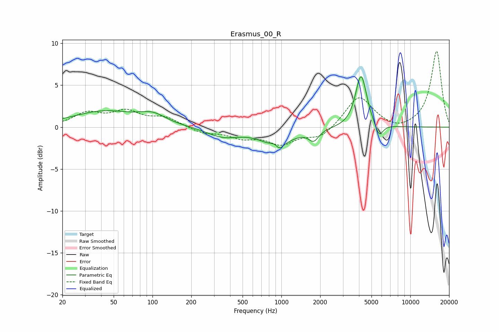

# Erasmus_00_R
See [usage instructions](https://github.com/jaakkopasanen/AutoEq#usage) for more options and info.

### Parametric EQs
Apply preamp of -6.1 dB when using parametric equalizer.

|   # | Type    |   Fc (Hz) |    Q |   Gain (dB) |
|-----|---------|-----------|------|-------------|
|   1 | Peaking |        42 | 0.58 |         1.8 |
|   2 | Peaking |       100 | 1.41 |         1.1 |
|   3 | Peaking |       352 | 1.12 |        -1.1 |
|   4 | Peaking |       914 | 1.2  |        -2   |
|   5 | Peaking |       916 | 3.95 |         0.9 |
|   6 | Peaking |       954 | 4.94 |        -1.1 |
|   7 | Peaking |      1781 | 3.66 |        -1.3 |
|   8 | Peaking |      4111 | 3.39 |         5   |
|   9 | Peaking |      4311 | 3.61 |         1.4 |
|  10 | Peaking |      5728 | 4.42 |        -1.7 |

### Fixed Band EQs
When using fixed band (also called graphic) equalizer, apply preamp of **-9.1 dB** (if available) and set gains manually with these parameters.

|   # | Type    |   Fc (Hz) |    Q |   Gain (dB) |
|-----|---------|-----------|------|-------------|
|   1 | Peaking |        31 | 1.41 |         1.6 |
|   2 | Peaking |        62 | 1.41 |         1.7 |
|   3 | Peaking |       125 | 1.41 |         1.1 |
|   4 | Peaking |       250 | 1.41 |        -0.7 |
|   5 | Peaking |       500 | 1.41 |        -1.1 |
|   6 | Peaking |      1000 | 1.41 |        -1.9 |
|   7 | Peaking |      2000 | 1.41 |        -1.3 |
|   8 | Peaking |      4000 | 1.41 |         3.8 |
|   9 | Peaking |      8000 | 1.41 |        -0.5 |
|  10 | Peaking |     16000 | 1.41 |         9.1 |

### Graphs

