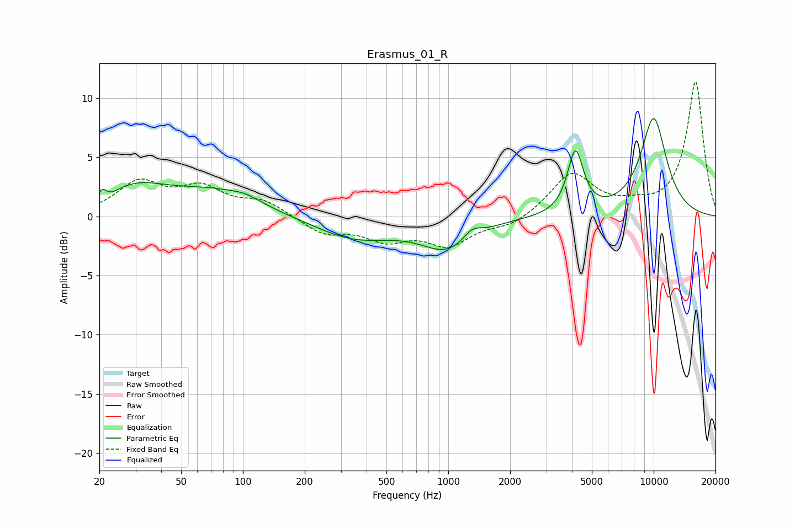

# Erasmus_01_R
See [usage instructions](https://github.com/jaakkopasanen/AutoEq#usage) for more options and info.

### Parametric EQs
Apply preamp of -8.4 dB when using parametric equalizer.

|   # | Type    |   Fc (Hz) |    Q |   Gain (dB) |
|-----|---------|-----------|------|-------------|
|   1 | Peaking |        20 | 2.9  |        -1.4 |
|   2 | Peaking |        21 | 5.83 |         1.7 |
|   3 | Peaking |        29 | 0.87 |         2.3 |
|   4 | Peaking |        73 | 0.65 |         1.9 |
|   5 | Peaking |       103 | 2.12 |         0.4 |
|   6 | Peaking |       350 | 0.72 |        -1.9 |
|   7 | Peaking |       994 | 1.09 |        -2.6 |
|   8 | Peaking |      1305 | 3.19 |         0.9 |
|   9 | Peaking |      4160 | 3.69 |         5.3 |
|  10 | Peaking |     10000 | 1.84 |         8.2 |

### Fixed Band EQs
When using fixed band (also called graphic) equalizer, apply preamp of **-11.5 dB** (if available) and set gains manually with these parameters.

|   # | Type    |   Fc (Hz) |    Q |   Gain (dB) |
|-----|---------|-----------|------|-------------|
|   1 | Peaking |        31 | 1.41 |         2.7 |
|   2 | Peaking |        62 | 1.41 |         2.2 |
|   3 | Peaking |       125 | 1.41 |         1.2 |
|   4 | Peaking |       250 | 1.41 |        -1.4 |
|   5 | Peaking |       500 | 1.41 |        -1.7 |
|   6 | Peaking |      1000 | 1.41 |        -2.2 |
|   7 | Peaking |      2000 | 1.41 |        -0.8 |
|   8 | Peaking |      4000 | 1.41 |         3.6 |
|   9 | Peaking |      8000 | 1.41 |         0.6 |
|  10 | Peaking |     16000 | 1.41 |        11.4 |

### Graphs

