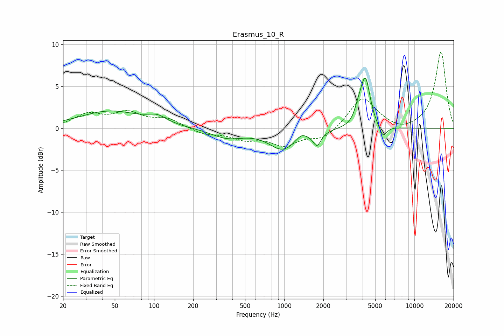

# Erasmus_10_R
See [usage instructions](https://github.com/jaakkopasanen/AutoEq#usage) for more options and info.

### Parametric EQs
Apply preamp of -6.1 dB when using parametric equalizer.

|   # | Type    |   Fc (Hz) |    Q |   Gain (dB) |
|-----|---------|-----------|------|-------------|
|   1 | Peaking |        46 | 0.6  |         2   |
|   2 | Peaking |       106 | 1.94 |         0.8 |
|   3 | Peaking |       365 | 1.14 |        -1.1 |
|   4 | Peaking |       977 | 1.32 |        -2.4 |
|   5 | Peaking |      1353 | 3.67 |         0.7 |
|   6 | Peaking |      1788 | 4.63 |        -1.6 |
|   7 | Peaking |      3653 | 5.97 |         0.8 |
|   8 | Peaking |      3986 | 4.15 |         1.6 |
|   9 | Peaking |      4241 | 3.99 |         4.7 |
|  10 | Peaking |      5729 | 4.63 |        -1.5 |

### Fixed Band EQs
When using fixed band (also called graphic) equalizer, apply preamp of **-9.2 dB** (if available) and set gains manually with these parameters.

|   # | Type    |   Fc (Hz) |    Q |   Gain (dB) |
|-----|---------|-----------|------|-------------|
|   1 | Peaking |        31 | 1.41 |         1.5 |
|   2 | Peaking |        62 | 1.41 |         1.7 |
|   3 | Peaking |       125 | 1.41 |         1.1 |
|   4 | Peaking |       250 | 1.41 |        -0.7 |
|   5 | Peaking |       500 | 1.41 |        -1.1 |
|   6 | Peaking |      1000 | 1.41 |        -1.8 |
|   7 | Peaking |      2000 | 1.41 |        -1.3 |
|   8 | Peaking |      4000 | 1.41 |         3.8 |
|   9 | Peaking |      8000 | 1.41 |        -0.5 |
|  10 | Peaking |     16000 | 1.41 |         9.1 |

### Graphs

