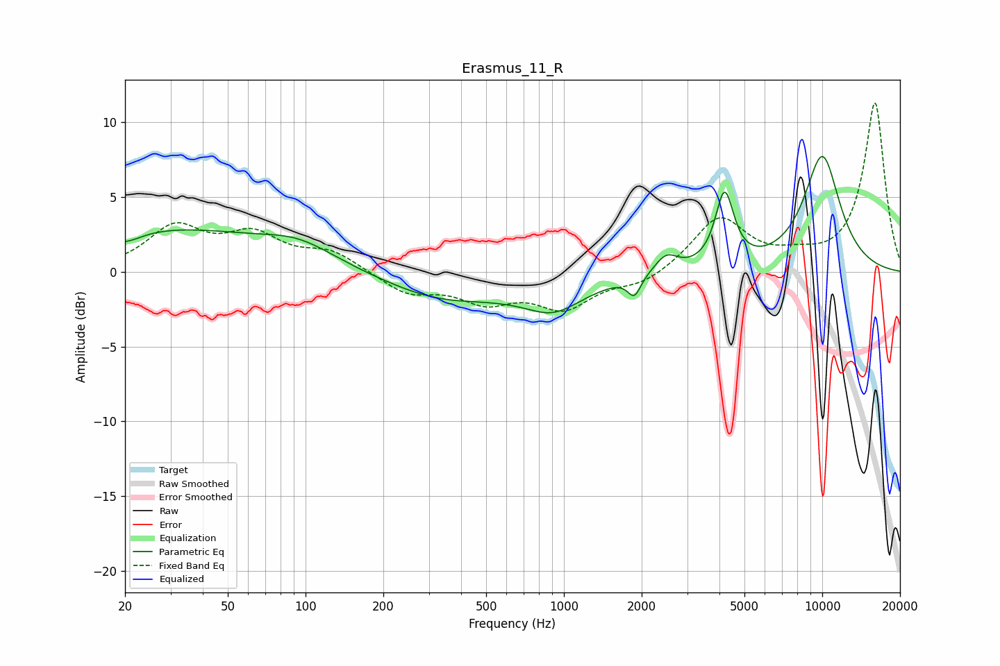

# Erasmus_11_R
See [usage instructions](https://github.com/jaakkopasanen/AutoEq#usage) for more options and info.

### Parametric EQs
Apply preamp of -7.8 dB when using parametric equalizer.

|   # | Type    |   Fc (Hz) |    Q |   Gain (dB) |
|-----|---------|-----------|------|-------------|
|   1 | Peaking |        20 | 2.24 |        -0.7 |
|   2 | Peaking |        28 | 0.35 |         2.8 |
|   3 | Peaking |        94 | 0.99 |         1.2 |
|   4 | Peaking |       335 | 0.64 |        -1.7 |
|   5 | Peaking |       746 | 1.67 |         0.4 |
|   6 | Peaking |       872 | 1.08 |        -2.6 |
|   7 | Peaking |      1874 | 5.67 |        -1.3 |
|   8 | Peaking |      2490 | 3.19 |         1.2 |
|   9 | Peaking |      4188 | 3.97 |         4.9 |
|  10 | Peaking |     10000 | 1.66 |         7.7 |

### Fixed Band EQs
When using fixed band (also called graphic) equalizer, apply preamp of **-11.4 dB** (if available) and set gains manually with these parameters.

|   # | Type    |   Fc (Hz) |    Q |   Gain (dB) |
|-----|---------|-----------|------|-------------|
|   1 | Peaking |        31 | 1.41 |         2.8 |
|   2 | Peaking |        62 | 1.41 |         2.2 |
|   3 | Peaking |       125 | 1.41 |         1.3 |
|   4 | Peaking |       250 | 1.41 |        -1.4 |
|   5 | Peaking |       500 | 1.41 |        -1.7 |
|   6 | Peaking |      1000 | 1.41 |        -2.3 |
|   7 | Peaking |      2000 | 1.41 |        -0.8 |
|   8 | Peaking |      4000 | 1.41 |         3.6 |
|   9 | Peaking |      8000 | 1.41 |         0.7 |
|  10 | Peaking |     16000 | 1.41 |        11.3 |

### Graphs

