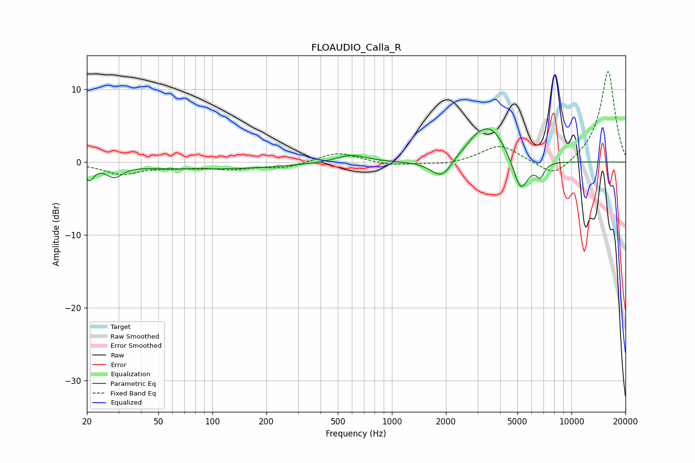

# FLOAUDIO_Calla_R
See [usage instructions](https://github.com/jaakkopasanen/AutoEq#usage) for more options and info.

### Parametric EQs
Apply preamp of -4.7 dB when using parametric equalizer.

|   # | Type    |   Fc (Hz) |    Q |   Gain (dB) |
|-----|---------|-----------|------|-------------|
|   1 | Peaking |        21 | 5.84 |        -2   |
|   2 | Peaking |        28 | 3.21 |        -1.5 |
|   3 | Peaking |        95 | 0.33 |        -0.9 |
|   4 | Peaking |       591 | 1.67 |         1.1 |
|   5 | Peaking |      1909 | 2.27 |        -2.7 |
|   6 | Peaking |      2259 | 3.91 |         0.4 |
|   7 | Peaking |      2933 | 2.09 |         1.7 |
|   8 | Peaking |      3605 | 1.64 |         4.3 |
|   9 | Peaking |      5211 | 3.23 |        -4.8 |
|  10 | Peaking |      6704 | 5.98 |        -1.8 |

### Fixed Band EQs
When using fixed band (also called graphic) equalizer, apply preamp of **-12.5 dB** (if available) and set gains manually with these parameters.

|   # | Type    |   Fc (Hz) |    Q |   Gain (dB) |
|-----|---------|-----------|------|-------------|
|   1 | Peaking |        31 | 1.41 |        -1.6 |
|   2 | Peaking |        62 | 1.41 |        -0.6 |
|   3 | Peaking |       125 | 1.41 |        -0.8 |
|   4 | Peaking |       250 | 1.41 |        -0.8 |
|   5 | Peaking |       500 | 1.41 |         1.4 |
|   6 | Peaking |      1000 | 1.41 |        -0.5 |
|   7 | Peaking |      2000 | 1.41 |        -0.4 |
|   8 | Peaking |      4000 | 1.41 |         2.4 |
|   9 | Peaking |      8000 | 1.41 |        -2.3 |
|  10 | Peaking |     16000 | 1.41 |        12.6 |

### Graphs

