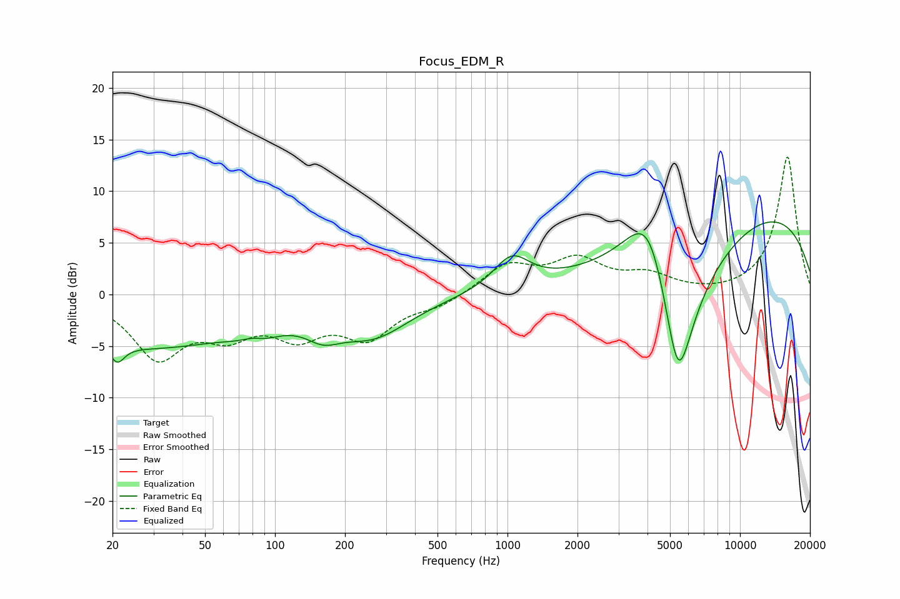

# Focus_EDM_R
See [usage instructions](https://github.com/jaakkopasanen/AutoEq#usage) for more options and info.

### Parametric EQs
Apply preamp of -7.1 dB when using parametric equalizer.

|   # | Type    |   Fc (Hz) |    Q |   Gain (dB) |
|-----|---------|-----------|------|-------------|
|   1 | Peaking |        21 | 4.71 |        -1.7 |
|   2 | Peaking |        28 | 0.35 |        -5   |
|   3 | Peaking |        81 | 2.31 |         2.8 |
|   4 | Peaking |        82 | 1.88 |        -3.6 |
|   5 | Peaking |       161 | 1.91 |        -1.7 |
|   6 | Peaking |       265 | 0.88 |        -3.6 |
|   7 | Peaking |      1042 | 1.81 |         3.1 |
|   8 | Peaking |      4078 | 1.28 |         9.6 |
|   9 | Peaking |      5412 | 1.31 |       -20   |
|  10 | Peaking |      9899 | 0.23 |         9.2 |

### Fixed Band EQs
When using fixed band (also called graphic) equalizer, apply preamp of **-13.4 dB** (if available) and set gains manually with these parameters.

|   # | Type    |   Fc (Hz) |    Q |   Gain (dB) |
|-----|---------|-----------|------|-------------|
|   1 | Peaking |        31 | 1.41 |        -5.8 |
|   2 | Peaking |        62 | 1.41 |        -3.1 |
|   3 | Peaking |       125 | 1.41 |        -3.4 |
|   4 | Peaking |       250 | 1.41 |        -3.8 |
|   5 | Peaking |       500 | 1.41 |        -1   |
|   6 | Peaking |      1000 | 1.41 |         2.7 |
|   7 | Peaking |      2000 | 1.41 |         3.1 |
|   8 | Peaking |      4000 | 1.41 |         1.6 |
|   9 | Peaking |      8000 | 1.41 |        -0.1 |
|  10 | Peaking |     16000 | 1.41 |        13.4 |

### Graphs

