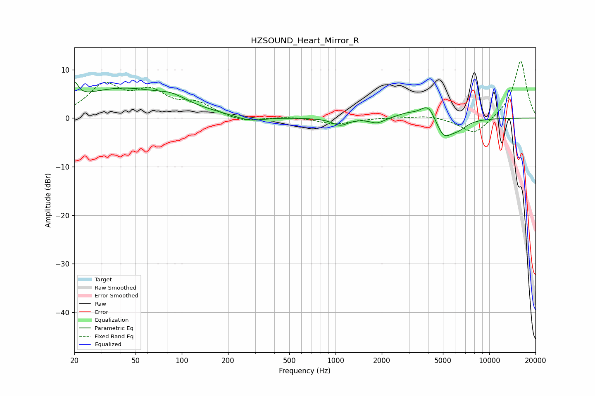

# HZSOUND_Heart_Mirror_R
See [usage instructions](https://github.com/jaakkopasanen/AutoEq#usage) for more options and info.

### Parametric EQs
Apply preamp of -7.5 dB when using parametric equalizer.

|   # | Type    |   Fc (Hz) |    Q |   Gain (dB) |
|-----|---------|-----------|------|-------------|
|   1 | Peaking |        20 | 5.76 |         3.3 |
|   2 | Peaking |        41 | 0.44 |         6   |
|   3 | Peaking |        87 | 1.6  |         1.3 |
|   4 | Peaking |       274 | 1.55 |        -1.1 |
|   5 | Peaking |      1071 | 2.81 |        -1.5 |
|   6 | Peaking |      1865 | 3.01 |        -1.1 |
|   7 | Peaking |      2926 | 1.96 |         0.9 |
|   8 | Peaking |      4024 | 2.78 |         3.4 |
|   9 | Peaking |      5036 | 2.61 |        -4   |
|  10 | Peaking |      6274 | 2.3  |        -1.7 |

### Fixed Band EQs
When using fixed band (also called graphic) equalizer, apply preamp of **-11.8 dB** (if available) and set gains manually with these parameters.

|   # | Type    |   Fc (Hz) |    Q |   Gain (dB) |
|-----|---------|-----------|------|-------------|
|   1 | Peaking |        31 | 1.41 |         6.4 |
|   2 | Peaking |        62 | 1.41 |         4.7 |
|   3 | Peaking |       125 | 1.41 |         2.6 |
|   4 | Peaking |       250 | 1.41 |        -1   |
|   5 | Peaking |       500 | 1.41 |         0.3 |
|   6 | Peaking |      1000 | 1.41 |        -1.3 |
|   7 | Peaking |      2000 | 1.41 |         0.1 |
|   8 | Peaking |      4000 | 1.41 |         0.6 |
|   9 | Peaking |      8000 | 1.41 |        -3.6 |
|  10 | Peaking |     16000 | 1.41 |        12   |

### Graphs

