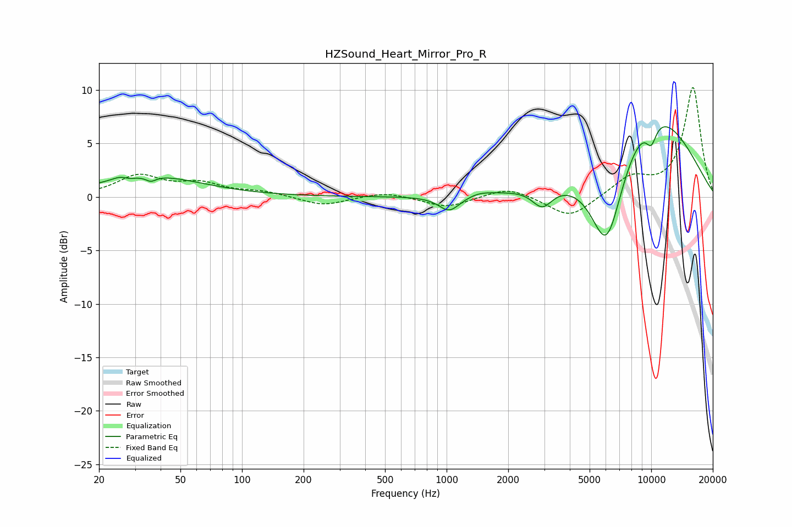

# HZSound_Heart_Mirror_Pro_R
See [usage instructions](https://github.com/jaakkopasanen/AutoEq#usage) for more options and info.

### Parametric EQs
Apply preamp of -6.7 dB when using parametric equalizer.

|   # | Type    |   Fc (Hz) |    Q |   Gain (dB) |
|-----|---------|-----------|------|-------------|
|   1 | Peaking |        25 | 4.03 |         0.3 |
|   2 | Peaking |        28 | 5.98 |        -0.1 |
|   3 | Peaking |        36 | 5.77 |        -0.5 |
|   4 | Peaking |        36 | 0.58 |         1.9 |
|   5 | Peaking |      1031 | 2.74 |        -1.5 |
|   6 | Peaking |      1454 | 2.43 |         0.3 |
|   7 | Peaking |      2938 | 2.84 |        -1.9 |
|   8 | Peaking |      6062 | 1.59 |        -9.7 |
|   9 | Peaking |      9640 | 0.48 |         8.7 |
|  10 | Peaking |     10000 | 4.53 |        -1.9 |

### Fixed Band EQs
When using fixed band (also called graphic) equalizer, apply preamp of **-10.3 dB** (if available) and set gains manually with these parameters.

|   # | Type    |   Fc (Hz) |    Q |   Gain (dB) |
|-----|---------|-----------|------|-------------|
|   1 | Peaking |        31 | 1.41 |         1.9 |
|   2 | Peaking |        62 | 1.41 |         1.1 |
|   3 | Peaking |       125 | 1.41 |         0.4 |
|   4 | Peaking |       250 | 1.41 |        -0.8 |
|   5 | Peaking |       500 | 1.41 |         0.5 |
|   6 | Peaking |      1000 | 1.41 |        -1   |
|   7 | Peaking |      2000 | 1.41 |         1   |
|   8 | Peaking |      4000 | 1.41 |        -2   |
|   9 | Peaking |      8000 | 1.41 |         1.8 |
|  10 | Peaking |     16000 | 1.41 |        10.2 |

### Graphs

