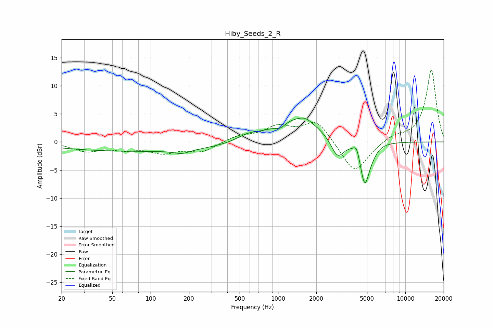

# Hiby_Seeds_2_R
See [usage instructions](https://github.com/jaakkopasanen/AutoEq#usage) for more options and info.

### Parametric EQs
Apply preamp of -4.3 dB when using parametric equalizer.

|   # | Type    |   Fc (Hz) |    Q |   Gain (dB) |
|-----|---------|-----------|------|-------------|
|   1 | Peaking |        86 | 0.18 |        -1.7 |
|   2 | Peaking |       176 | 2.29 |        -0.7 |
|   3 | Peaking |       576 | 1.67 |         1   |
|   4 | Peaking |      1043 | 3.6  |        -0.9 |
|   5 | Peaking |      1405 | 0.74 |         4.3 |
|   6 | Peaking |      1643 | 2.99 |         0.6 |
|   7 | Peaking |      2936 | 2.69 |        -3.7 |
|   8 | Peaking |      4142 | 6    |         1.8 |
|   9 | Peaking |      4800 | 3.77 |        -7.5 |
|  10 | Peaking |      5497 | 3.4  |        -0.8 |

### Fixed Band EQs
When using fixed band (also called graphic) equalizer, apply preamp of **-12.9 dB** (if available) and set gains manually with these parameters.

|   # | Type    |   Fc (Hz) |    Q |   Gain (dB) |
|-----|---------|-----------|------|-------------|
|   1 | Peaking |        31 | 1.41 |        -1.5 |
|   2 | Peaking |        62 | 1.41 |        -1.1 |
|   3 | Peaking |       125 | 1.41 |        -1.7 |
|   4 | Peaking |       250 | 1.41 |        -1.7 |
|   5 | Peaking |       500 | 1.41 |         1   |
|   6 | Peaking |      1000 | 1.41 |         2.5 |
|   7 | Peaking |      2000 | 1.41 |         3.8 |
|   8 | Peaking |      4000 | 1.41 |        -5.8 |
|   9 | Peaking |      8000 | 1.41 |         1   |
|  10 | Peaking |     16000 | 1.41 |        12.9 |

### Graphs

