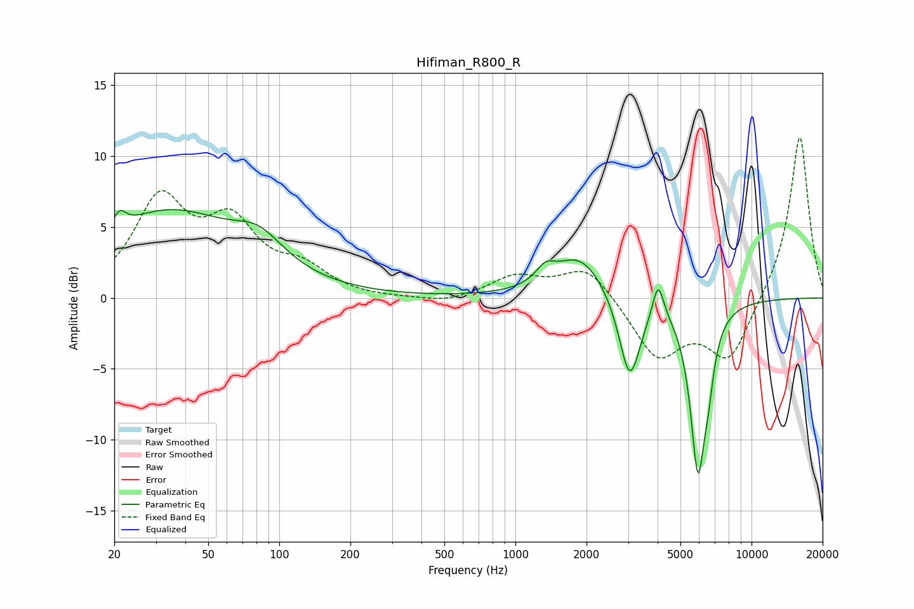

# Hifiman_R800_R
See [usage instructions](https://github.com/jaakkopasanen/AutoEq#usage) for more options and info.

### Parametric EQs
Apply preamp of -6.3 dB when using parametric equalizer.

|   # | Type    |   Fc (Hz) |    Q |   Gain (dB) |
|-----|---------|-----------|------|-------------|
|   1 | Peaking |        21 | 5.89 |        -2.3 |
|   2 | Peaking |        21 | 5.64 |         3.4 |
|   3 | Peaking |        34 | 0.47 |         5.9 |
|   4 | Peaking |        82 | 1.35 |         1.9 |
|   5 | Peaking |      1339 | 3.6  |         1   |
|   6 | Peaking |      1876 | 1.29 |         3   |
|   7 | Peaking |      3050 | 3.1  |        -6.1 |
|   8 | Peaking |      4023 | 6    |         2.6 |
|   9 | Peaking |      5931 | 4.16 |       -11.6 |
|  10 | Peaking |      6573 | 6    |        -2.3 |

### Fixed Band EQs
When using fixed band (also called graphic) equalizer, apply preamp of **-11.4 dB** (if available) and set gains manually with these parameters.

|   # | Type    |   Fc (Hz) |    Q |   Gain (dB) |
|-----|---------|-----------|------|-------------|
|   1 | Peaking |        31 | 1.41 |         6.6 |
|   2 | Peaking |        62 | 1.41 |         4.7 |
|   3 | Peaking |       125 | 1.41 |         1.8 |
|   4 | Peaking |       250 | 1.41 |        -0.1 |
|   5 | Peaking |       500 | 1.41 |        -0.4 |
|   6 | Peaking |      1000 | 1.41 |         1.4 |
|   7 | Peaking |      2000 | 1.41 |         2.3 |
|   8 | Peaking |      4000 | 1.41 |        -4.1 |
|   9 | Peaking |      8000 | 1.41 |        -4.4 |
|  10 | Peaking |     16000 | 1.41 |        11.6 |

### Graphs

