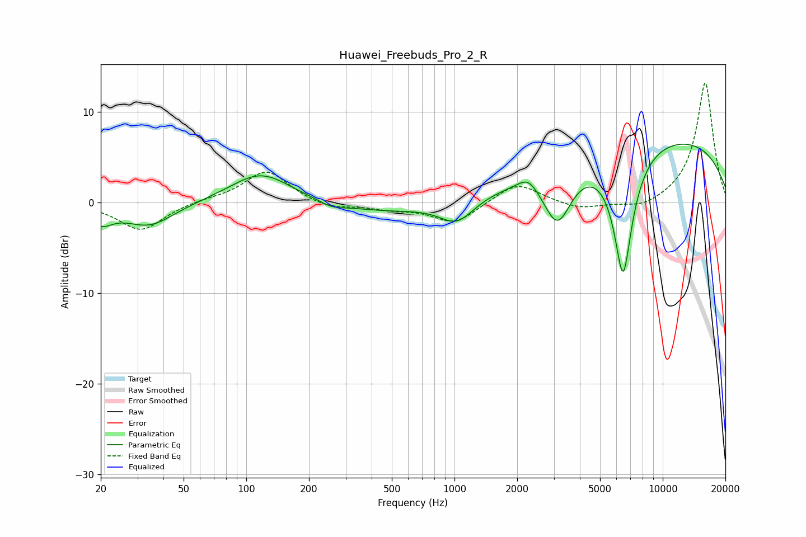

# Huawei_Freebuds_Pro_2_R
See [usage instructions](https://github.com/jaakkopasanen/AutoEq#usage) for more options and info.

### Parametric EQs
Apply preamp of -6.5 dB when using parametric equalizer.

|   # | Type    |   Fc (Hz) |    Q |   Gain (dB) |
|-----|---------|-----------|------|-------------|
|   1 | Peaking |        20 | 2.56 |        -1.8 |
|   2 | Peaking |        34 | 1.18 |        -2.6 |
|   3 | Peaking |       117 | 0.98 |         3.3 |
|   4 | Peaking |       257 | 2.21 |        -0.6 |
|   5 | Peaking |       479 | 0.58 |        -1.1 |
|   6 | Peaking |      1027 | 1.71 |        -2.6 |
|   7 | Peaking |      2260 | 3.01 |         1.3 |
|   8 | Peaking |      3123 | 2.04 |        -6.3 |
|   9 | Peaking |      6450 | 2.85 |       -14.2 |
|  10 | Peaking |      9240 | 0.22 |         7.4 |

### Fixed Band EQs
When using fixed band (also called graphic) equalizer, apply preamp of **-13.3 dB** (if available) and set gains manually with these parameters.

|   # | Type    |   Fc (Hz) |    Q |   Gain (dB) |
|-----|---------|-----------|------|-------------|
|   1 | Peaking |        31 | 1.41 |        -3.1 |
|   2 | Peaking |        62 | 1.41 |         0.3 |
|   3 | Peaking |       125 | 1.41 |         3.6 |
|   4 | Peaking |       250 | 1.41 |        -0.8 |
|   5 | Peaking |       500 | 1.41 |        -0.6 |
|   6 | Peaking |      1000 | 1.41 |        -2.3 |
|   7 | Peaking |      2000 | 1.41 |         2.3 |
|   8 | Peaking |      4000 | 1.41 |        -0.8 |
|   9 | Peaking |      8000 | 1.41 |        -0.8 |
|  10 | Peaking |     16000 | 1.41 |        13.4 |

### Graphs

