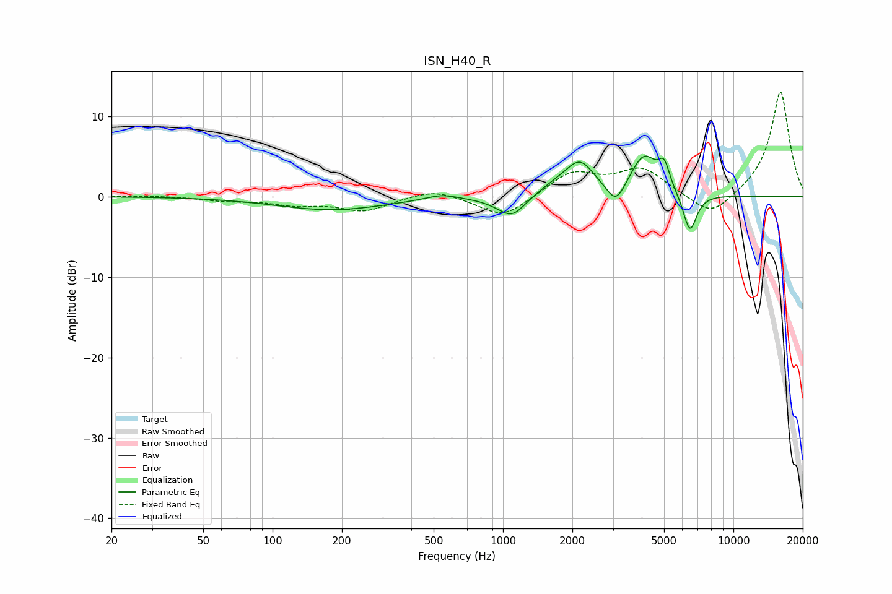

# ISN_H40_R
See [usage instructions](https://github.com/jaakkopasanen/AutoEq#usage) for more options and info.

### Parametric EQs
Apply preamp of -5.1 dB when using parametric equalizer.

|   # | Type    |   Fc (Hz) |    Q |   Gain (dB) |
|-----|---------|-----------|------|-------------|
|   1 | Peaking |       180 | 0.6  |        -1.6 |
|   2 | Peaking |       541 | 2.01 |         0.7 |
|   3 | Peaking |      1012 | 1.65 |        -0.5 |
|   4 | Peaking |      1096 | 2.45 |        -2.3 |
|   5 | Peaking |      1686 | 1.67 |         1   |
|   6 | Peaking |      2158 | 2.23 |         3.9 |
|   7 | Peaking |      3092 | 3.55 |        -2.7 |
|   8 | Peaking |      4093 | 2.37 |         4.9 |
|   9 | Peaking |      5004 | 5.8  |         2.8 |
|  10 | Peaking |      6472 | 4.6  |        -4.9 |

### Fixed Band EQs
When using fixed band (also called graphic) equalizer, apply preamp of **-13.1 dB** (if available) and set gains manually with these parameters.

|   # | Type    |   Fc (Hz) |    Q |   Gain (dB) |
|-----|---------|-----------|------|-------------|
|   1 | Peaking |        31 | 1.41 |         0.1 |
|   2 | Peaking |        62 | 1.41 |        -0.4 |
|   3 | Peaking |       125 | 1.41 |        -0.9 |
|   4 | Peaking |       250 | 1.41 |        -1.7 |
|   5 | Peaking |       500 | 1.41 |         1.1 |
|   6 | Peaking |      1000 | 1.41 |        -2.7 |
|   7 | Peaking |      2000 | 1.41 |         2.9 |
|   8 | Peaking |      4000 | 1.41 |         3.3 |
|   9 | Peaking |      8000 | 1.41 |        -2.9 |
|  10 | Peaking |     16000 | 1.41 |        13.2 |

### Graphs

