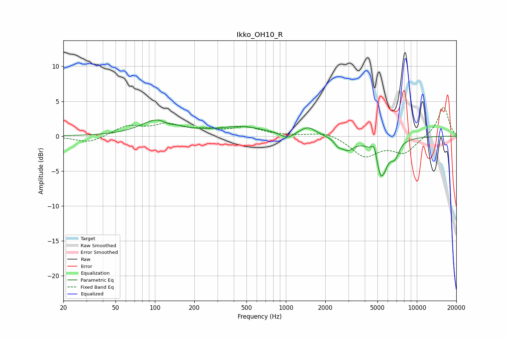

# Ikko_OH10_R
See [usage instructions](https://github.com/jaakkopasanen/AutoEq#usage) for more options and info.

### Parametric EQs
Apply preamp of -2.4 dB when using parametric equalizer.

|   # | Type    |   Fc (Hz) |    Q |   Gain (dB) |
|-----|---------|-----------|------|-------------|
|   1 | Peaking |       108 | 1.09 |         2.4 |
|   2 | Peaking |       126 | 3.1  |        -0.5 |
|   3 | Peaking |       459 | 0.75 |         1.3 |
|   4 | Peaking |      1022 | 2.99 |        -0.9 |
|   5 | Peaking |      1475 | 2.33 |         1.3 |
|   6 | Peaking |      2497 | 5.66 |        -0.7 |
|   7 | Peaking |      2952 | 2.82 |        -1.7 |
|   8 | Peaking |      4749 | 6    |         2.5 |
|   9 | Peaking |      5307 | 2.92 |        -6.1 |
|  10 | Peaking |      6814 | 4.44 |        -1.9 |

### Fixed Band EQs
When using fixed band (also called graphic) equalizer, apply preamp of **-4.3 dB** (if available) and set gains manually with these parameters.

|   # | Type    |   Fc (Hz) |    Q |   Gain (dB) |
|-----|---------|-----------|------|-------------|
|   1 | Peaking |        31 | 1.41 |        -1   |
|   2 | Peaking |        62 | 1.41 |         1.4 |
|   3 | Peaking |       125 | 1.41 |         1.5 |
|   4 | Peaking |       250 | 1.41 |         0.7 |
|   5 | Peaking |       500 | 1.41 |         1.2 |
|   6 | Peaking |      1000 | 1.41 |         0   |
|   7 | Peaking |      2000 | 1.41 |         0.7 |
|   8 | Peaking |      4000 | 1.41 |        -2.8 |
|   9 | Peaking |      8000 | 1.41 |        -2.3 |
|  10 | Peaking |     16000 | 1.41 |         4.3 |

### Graphs

