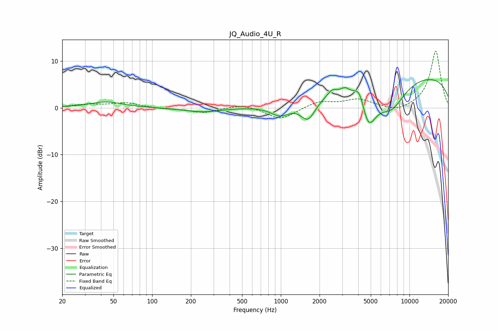

# JQ_Audio_4U_R
See [usage instructions](https://github.com/jaakkopasanen/AutoEq#usage) for more options and info.

### Parametric EQs
Apply preamp of -6.1 dB when using parametric equalizer.

|   # | Type    |   Fc (Hz) |    Q |   Gain (dB) |
|-----|---------|-----------|------|-------------|
|   1 | Peaking |        44 | 1.11 |         1.3 |
|   2 | Peaking |       247 | 1.03 |        -0.9 |
|   3 | Peaking |       993 | 1.86 |        -2.4 |
|   4 | Peaking |      1630 | 2.4  |        -4.4 |
|   5 | Peaking |      2508 | 4.13 |         1.2 |
|   6 | Peaking |      3162 | 4.32 |         1.1 |
|   7 | Peaking |      4091 | 3.39 |         3.8 |
|   8 | Peaking |      4775 | 2.2  |        -8.3 |
|   9 | Peaking |      7229 | 1.2  |        -6.1 |
|  10 | Peaking |      9738 | 0.18 |         7.3 |

### Fixed Band EQs
When using fixed band (also called graphic) equalizer, apply preamp of **-12.2 dB** (if available) and set gains manually with these parameters.

|   # | Type    |   Fc (Hz) |    Q |   Gain (dB) |
|-----|---------|-----------|------|-------------|
|   1 | Peaking |        31 | 1.41 |         0.7 |
|   2 | Peaking |        62 | 1.41 |         1   |
|   3 | Peaking |       125 | 1.41 |        -0.2 |
|   4 | Peaking |       250 | 1.41 |        -1   |
|   5 | Peaking |       500 | 1.41 |         0.9 |
|   6 | Peaking |      1000 | 1.41 |        -2.6 |
|   7 | Peaking |      2000 | 1.41 |         1.4 |
|   8 | Peaking |      4000 | 1.41 |         1.7 |
|   9 | Peaking |      8000 | 1.41 |        -1   |
|  10 | Peaking |     16000 | 1.41 |        12.2 |

### Graphs

