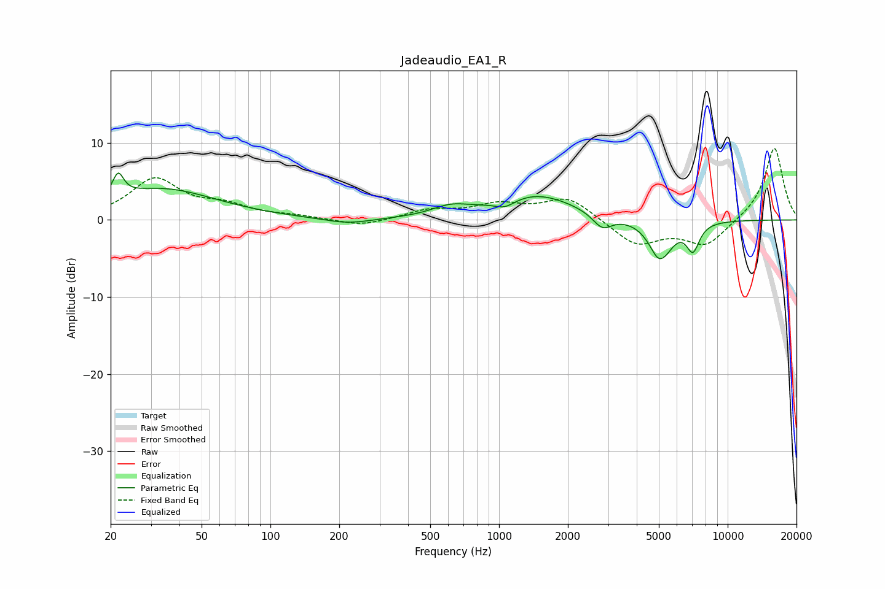

# Jadeaudio_EA1_R
See [usage instructions](https://github.com/jaakkopasanen/AutoEq#usage) for more options and info.

### Parametric EQs
Apply preamp of -6.2 dB when using parametric equalizer.

|   # | Type    |   Fc (Hz) |    Q |   Gain (dB) |
|-----|---------|-----------|------|-------------|
|   1 | Peaking |        22 | 5.99 |         3   |
|   2 | Peaking |        33 | 0.59 |         4   |
|   3 | Peaking |       218 | 1.36 |        -0.7 |
|   4 | Peaking |       613 | 1.74 |         1.2 |
|   5 | Peaking |      1063 | 3.05 |        -1.1 |
|   6 | Peaking |      1438 | 0.8  |         3.3 |
|   7 | Peaking |      2830 | 3.35 |        -1.9 |
|   8 | Peaking |      5099 | 3.05 |        -6   |
|   9 | Peaking |      5170 | 5.47 |         1   |
|  10 | Peaking |      7049 | 4.81 |        -3.4 |

### Fixed Band EQs
When using fixed band (also called graphic) equalizer, apply preamp of **-9.4 dB** (if available) and set gains manually with these parameters.

|   # | Type    |   Fc (Hz) |    Q |   Gain (dB) |
|-----|---------|-----------|------|-------------|
|   1 | Peaking |        31 | 1.41 |         5.2 |
|   2 | Peaking |        62 | 1.41 |         1.6 |
|   3 | Peaking |       125 | 1.41 |         0.4 |
|   4 | Peaking |       250 | 1.41 |        -0.9 |
|   5 | Peaking |       500 | 1.41 |         1.2 |
|   6 | Peaking |      1000 | 1.41 |         1.8 |
|   7 | Peaking |      2000 | 1.41 |         2.9 |
|   8 | Peaking |      4000 | 1.41 |        -3.3 |
|   9 | Peaking |      8000 | 1.41 |        -3.3 |
|  10 | Peaking |     16000 | 1.41 |         9.5 |

### Graphs

