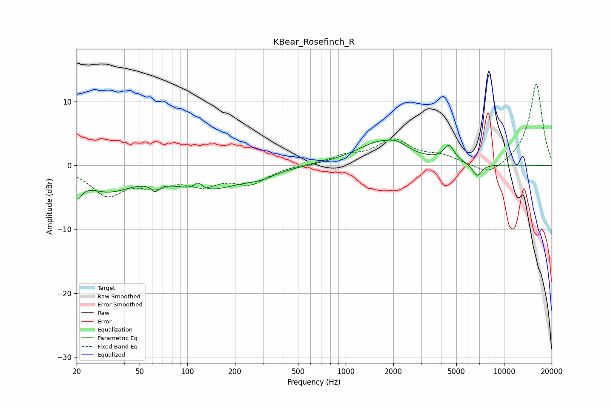

# KBear_Rosefinch_R
See [usage instructions](https://github.com/jaakkopasanen/AutoEq#usage) for more options and info.

### Parametric EQs
Apply preamp of -4.1 dB when using parametric equalizer.

|   # | Type    |   Fc (Hz) |    Q |   Gain (dB) |
|-----|---------|-----------|------|-------------|
|   1 | Peaking |        20 | 4.52 |        -3   |
|   2 | Peaking |        31 | 0.91 |        -3.5 |
|   3 | Peaking |        63 | 5.81 |        -1.2 |
|   4 | Peaking |       117 | 5.89 |         1.1 |
|   5 | Peaking |       133 | 0.66 |        -3.6 |
|   6 | Peaking |       290 | 1.57 |        -0.9 |
|   7 | Peaking |      1692 | 0.88 |         3.7 |
|   8 | Peaking |      2106 | 2.8  |         0.7 |
|   9 | Peaking |      4488 | 4.12 |         2.5 |
|  10 | Peaking |      6776 | 4.65 |        -2   |

### Fixed Band EQs
When using fixed band (also called graphic) equalizer, apply preamp of **-12.8 dB** (if available) and set gains manually with these parameters.

|   # | Type    |   Fc (Hz) |    Q |   Gain (dB) |
|-----|---------|-----------|------|-------------|
|   1 | Peaking |        31 | 1.41 |        -4.4 |
|   2 | Peaking |        62 | 1.41 |        -2.5 |
|   3 | Peaking |       125 | 1.41 |        -2.5 |
|   4 | Peaking |       250 | 1.41 |        -2.6 |
|   5 | Peaking |       500 | 1.41 |         0   |
|   6 | Peaking |      1000 | 1.41 |         1.3 |
|   7 | Peaking |      2000 | 1.41 |         3.8 |
|   8 | Peaking |      4000 | 1.41 |         1.3 |
|   9 | Peaking |      8000 | 1.41 |        -1.8 |
|  10 | Peaking |     16000 | 1.41 |        12.9 |

### Graphs

