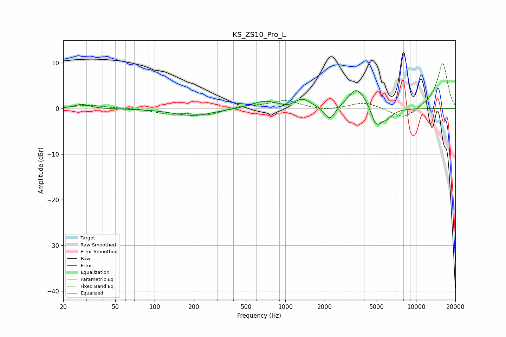

# KS_ZS10_Pro_L
See [usage instructions](https://github.com/jaakkopasanen/AutoEq#usage) for more options and info.

### Parametric EQs
Apply preamp of -4.0 dB when using parametric equalizer.

|   # | Type    |   Fc (Hz) |    Q |   Gain (dB) |
|-----|---------|-----------|------|-------------|
|   1 | Peaking |        28 | 2.69 |         0.9 |
|   2 | Peaking |       196 | 0.93 |        -1.6 |
|   3 | Peaking |       692 | 1.43 |         1.6 |
|   4 | Peaking |      1069 | 2.72 |        -0.6 |
|   5 | Peaking |      1339 | 2.2  |         2.1 |
|   6 | Peaking |      2191 | 3.6  |        -3   |
|   7 | Peaking |      3450 | 2.4  |         3.7 |
|   8 | Peaking |      4073 | 1.97 |         1.7 |
|   9 | Peaking |      4956 | 3.1  |        -4.5 |
|  10 | Peaking |      6023 | 2.97 |        -1.6 |

### Fixed Band EQs
When using fixed band (also called graphic) equalizer, apply preamp of **-9.9 dB** (if available) and set gains manually with these parameters.

|   # | Type    |   Fc (Hz) |    Q |   Gain (dB) |
|-----|---------|-----------|------|-------------|
|   1 | Peaking |        31 | 1.41 |         0.7 |
|   2 | Peaking |        62 | 1.41 |         0.1 |
|   3 | Peaking |       125 | 1.41 |        -1   |
|   4 | Peaking |       250 | 1.41 |        -1.4 |
|   5 | Peaking |       500 | 1.41 |         0.6 |
|   6 | Peaking |      1000 | 1.41 |         1.7 |
|   7 | Peaking |      2000 | 1.41 |        -0.5 |
|   8 | Peaking |      4000 | 1.41 |         1.4 |
|   9 | Peaking |      8000 | 1.41 |        -2.5 |
|  10 | Peaking |     16000 | 1.41 |        10   |

### Graphs

