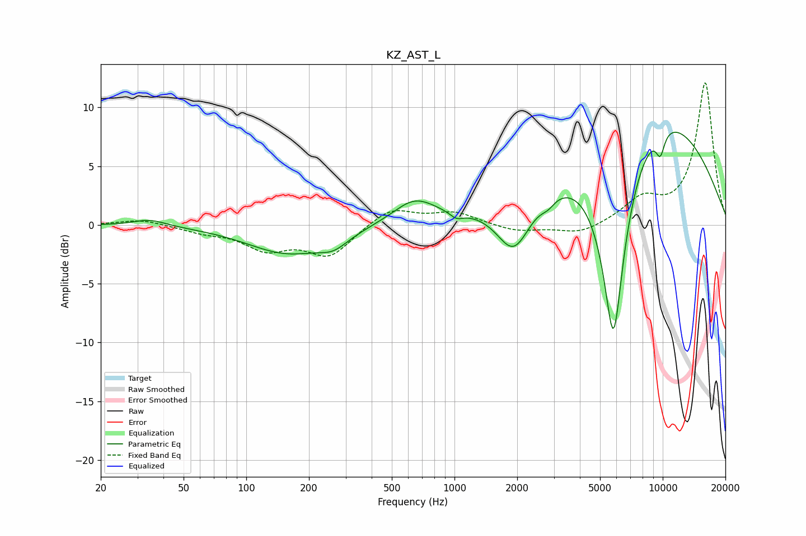

# KZ_AST_L
See [usage instructions](https://github.com/jaakkopasanen/AutoEq#usage) for more options and info.

### Parametric EQs
Apply preamp of -8.0 dB when using parametric equalizer.

|   # | Type    |   Fc (Hz) |    Q |   Gain (dB) |
|-----|---------|-----------|------|-------------|
|   1 | Peaking |        34 | 1.77 |         0.6 |
|   2 | Peaking |       158 | 0.73 |        -2.4 |
|   3 | Peaking |       262 | 1.97 |        -1   |
|   4 | Peaking |       643 | 1.36 |         2   |
|   5 | Peaking |      1022 | 4.56 |        -0.5 |
|   6 | Peaking |      1929 | 1.69 |        -4.7 |
|   7 | Peaking |      2811 | 4.07 |        -0.7 |
|   8 | Peaking |      5802 | 2    |       -19.6 |
|   9 | Peaking |      7857 | 0.34 |        11.9 |
|  10 | Peaking |      9733 | 5.83 |        -1.9 |

### Fixed Band EQs
When using fixed band (also called graphic) equalizer, apply preamp of **-12.2 dB** (if available) and set gains manually with these parameters.

|   # | Type    |   Fc (Hz) |    Q |   Gain (dB) |
|-----|---------|-----------|------|-------------|
|   1 | Peaking |        31 | 1.41 |         0.5 |
|   2 | Peaking |        62 | 1.41 |        -0.5 |
|   3 | Peaking |       125 | 1.41 |        -1.9 |
|   4 | Peaking |       250 | 1.41 |        -2.6 |
|   5 | Peaking |       500 | 1.41 |         1.5 |
|   6 | Peaking |      1000 | 1.41 |         1   |
|   7 | Peaking |      2000 | 1.41 |        -0.6 |
|   8 | Peaking |      4000 | 1.41 |        -0.8 |
|   9 | Peaking |      8000 | 1.41 |         2   |
|  10 | Peaking |     16000 | 1.41 |        12.1 |

### Graphs

