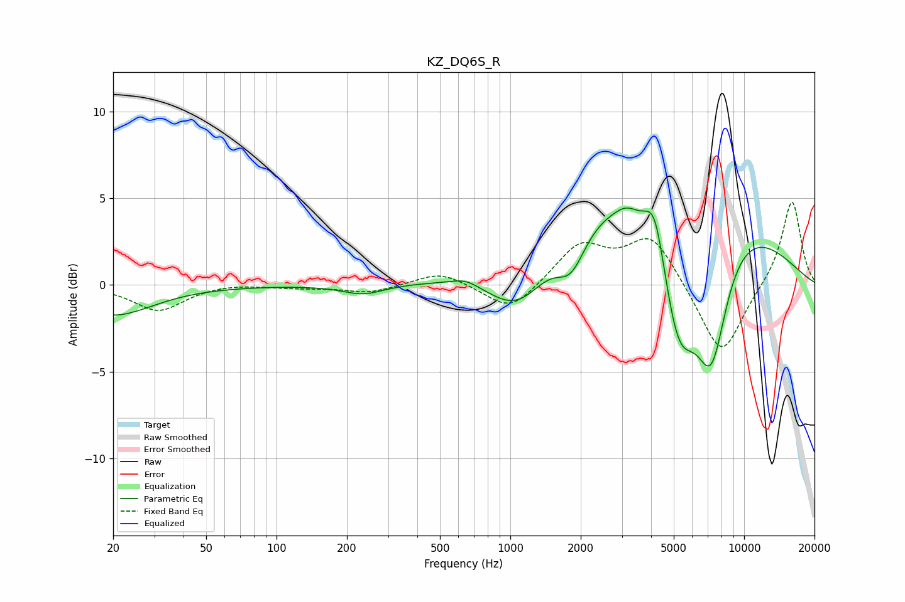

# KZ_DQ6S_R
See [usage instructions](https://github.com/jaakkopasanen/AutoEq#usage) for more options and info.

### Parametric EQs
Apply preamp of -4.5 dB when using parametric equalizer.

|   # | Type    |   Fc (Hz) |    Q |   Gain (dB) |
|-----|---------|-----------|------|-------------|
|   1 | Peaking |        20 | 0.84 |        -1.7 |
|   2 | Peaking |       235 | 1.57 |        -0.6 |
|   3 | Peaking |       643 | 2.5  |         0.4 |
|   4 | Peaking |      1085 | 1.03 |        -3.5 |
|   5 | Peaking |      1820 | 2.23 |        -2.3 |
|   6 | Peaking |      3142 | 3    |         0.5 |
|   7 | Peaking |      4158 | 3.15 |         3.1 |
|   8 | Peaking |      4285 | 0.28 |         6.6 |
|   9 | Peaking |      5231 | 1.58 |        -7.9 |
|  10 | Peaking |      7242 | 1.89 |        -7.3 |

### Fixed Band EQs
When using fixed band (also called graphic) equalizer, apply preamp of **-4.9 dB** (if available) and set gains manually with these parameters.

|   # | Type    |   Fc (Hz) |    Q |   Gain (dB) |
|-----|---------|-----------|------|-------------|
|   1 | Peaking |        31 | 1.41 |        -1.5 |
|   2 | Peaking |        62 | 1.41 |         0.1 |
|   3 | Peaking |       125 | 1.41 |        -0.1 |
|   4 | Peaking |       250 | 1.41 |        -0.5 |
|   5 | Peaking |       500 | 1.41 |         0.8 |
|   6 | Peaking |      1000 | 1.41 |        -1.6 |
|   7 | Peaking |      2000 | 1.41 |         2.3 |
|   8 | Peaking |      4000 | 1.41 |         2.8 |
|   9 | Peaking |      8000 | 1.41 |        -4.3 |
|  10 | Peaking |     16000 | 1.41 |         5   |

### Graphs

