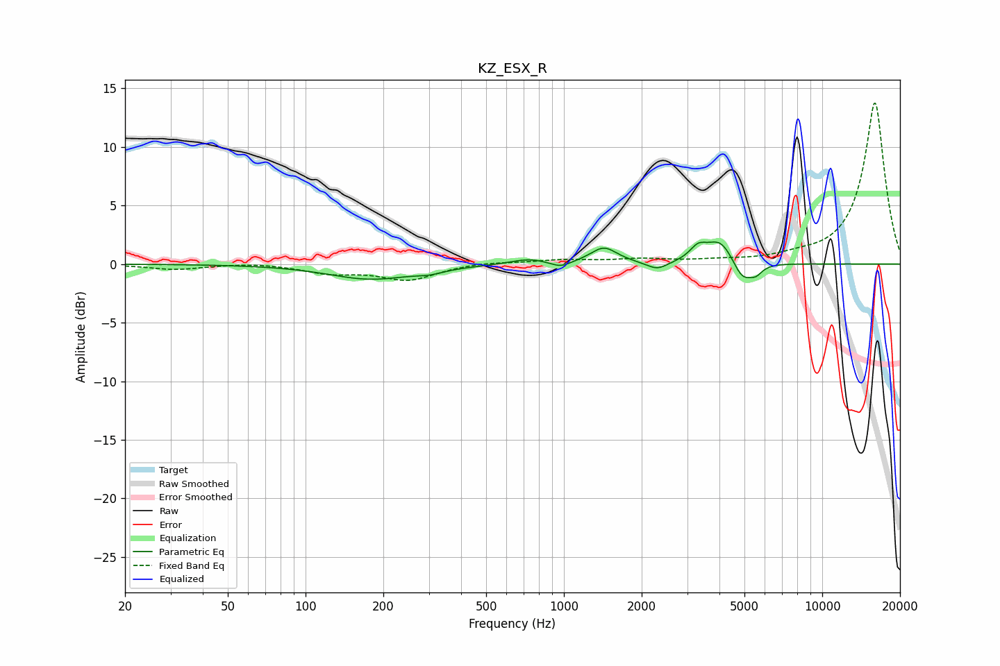

# KZ_ESX_R
See [usage instructions](https://github.com/jaakkopasanen/AutoEq#usage) for more options and info.

### Parametric EQs
Apply preamp of -2.0 dB when using parametric equalizer.

|   # | Type    |   Fc (Hz) |    Q |   Gain (dB) |
|-----|---------|-----------|------|-------------|
|   1 | Peaking |       179 | 0.86 |        -1.3 |
|   2 | Peaking |       303 | 2.68 |        -0.3 |
|   3 | Peaking |       727 | 2.03 |         0.5 |
|   4 | Peaking |       969 | 3.73 |        -0.5 |
|   5 | Peaking |      1428 | 2.74 |         1.4 |
|   6 | Peaking |      2299 | 3.43 |        -0.7 |
|   7 | Peaking |      3306 | 4.48 |         1   |
|   8 | Peaking |      4045 | 2.53 |         2.2 |
|   9 | Peaking |      4907 | 3.43 |        -1.9 |
|  10 | Peaking |      5547 | 6    |        -0.6 |

### Fixed Band EQs
When using fixed band (also called graphic) equalizer, apply preamp of **-13.8 dB** (if available) and set gains manually with these parameters.

|   # | Type    |   Fc (Hz) |    Q |   Gain (dB) |
|-----|---------|-----------|------|-------------|
|   1 | Peaking |        31 | 1.41 |        -0.4 |
|   2 | Peaking |        62 | 1.41 |         0.1 |
|   3 | Peaking |       125 | 1.41 |        -0.7 |
|   4 | Peaking |       250 | 1.41 |        -1.3 |
|   5 | Peaking |       500 | 1.41 |         0.2 |
|   6 | Peaking |      1000 | 1.41 |         0.3 |
|   7 | Peaking |      2000 | 1.41 |         0.4 |
|   8 | Peaking |      4000 | 1.41 |         0.2 |
|   9 | Peaking |      8000 | 1.41 |         0.4 |
|  10 | Peaking |     16000 | 1.41 |        13.8 |

### Graphs

